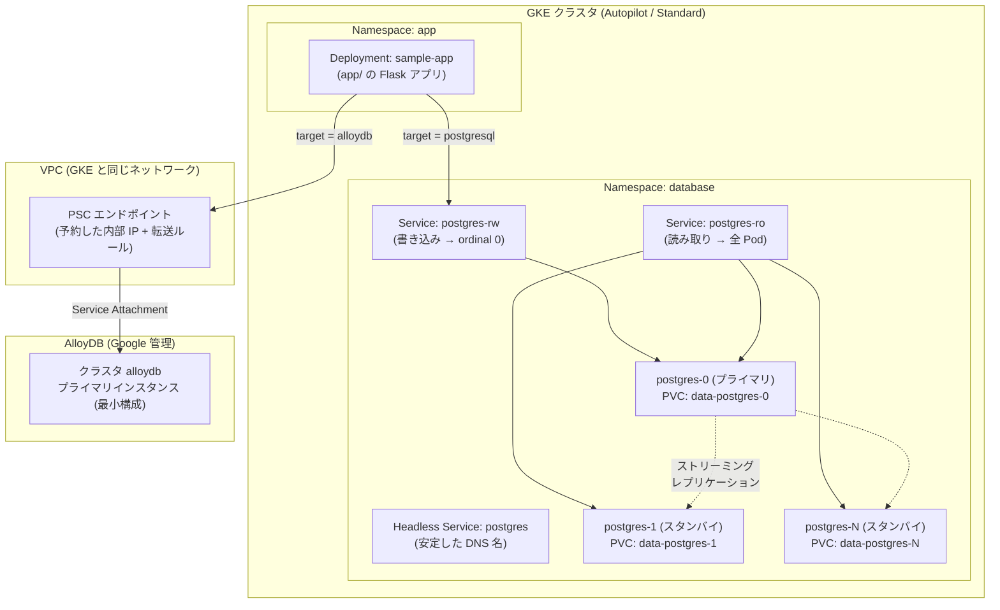

# gke-postgresql-statefulset

GKE 上に PostgreSQL を **StatefulSet** として、任意のサイズで構築するための Make ベースのツールです。クラスタは既定で **Autopilot** として作成します (`[cluster] mode = "standard"` で Standard クラスタにもできます)。

あわせて、**AlloyDB (最小構成) を Private Service Connect で用意する** ターゲットと、**StatefulSet の PostgreSQL と AlloyDB のどちらにも同じコードで接続できる Python のサンプル Web アプリ** (`app/`) が入っています。接続先は `config.toml` の `[app] target` で切り替えます。

```console
$ make db          # クラスタが無ければ作り、PostgreSQL StatefulSet を構築する
$ make db-content  # スキーマとダミーデータを投入する (pg_dump 形式からロード)
$ make alloydb     # AlloyDB (最小構成) + PSC エンドポイントを作り、DB とユーザを初期化する
$ make app         # サンプルアプリを GKE にデプロイする ([app] target の DB に接続)
```

サイズ（レプリカ数・ディスク容量・CPU / メモリ、Standard ならノード数とマシンタイプ）とディスクの種別 (Hyperdisk Balanced の IOPS / スループットを含む)、ロケーション、アプリの接続先は、すべて **`config.toml`** で指定します。

---

## 前提

| 必要なもの | 備考 |
| --- | --- |
| `gcloud` | 認証済みであること (`gcloud auth login`) |
| `kubectl` | `gcloud components install kubectl` |
| `python3` | 3.11 以上 (`tomllib` を使用) |
| `make` | GNU Make |
| `docker` (任意) | `[app] builder = "docker"` にしてイメージを手元でビルドする場合のみ。既定は Cloud Build |

課金が有効な Google Cloud プロジェクトが必要です。プロジェクトは `config.toml` の `[gcp] project` で指定するか、未指定なら `gcloud config get-value project` の値が使われます。

AlloyDB とサンプルアプリまで使う場合、実行するアカウントには GKE に加えて次の権限が必要です: AlloyDB 管理者 (`roles/alloydb.admin`)、Compute ネットワーク管理者 (`roles/compute.networkAdmin`: PSC エンドポイント用の予約 IP と転送ルール)、Artifact Registry 管理者と Cloud Build 編集者 (イメージのビルド)。プロジェクトのオーナー / 編集者であればすべて含まれます。

---

## クイックスタート

```console
$ make config          # config.toml.template から config.toml を作る
$ vi config.toml       # サイズやゾーンを調整する
$ make db              # クラスタ作成 (5〜10 分) + StatefulSet デプロイ
$ make db-content      # スキーマ + ダミーデータを投入
$ make psql            # psql で中身を確認する

$ make app             # サンプルアプリをビルドしてデプロイ (既定は StatefulSet に接続)
$ make app-port-forward   # http://localhost:8080/ で開く

$ make alloydb         # AlloyDB + PSC エンドポイントを作成 (10〜15 分)
$ make alloydb-content # AlloyDB にも同じスキーマ + ダミーデータを投入
$ make app-target T=alloydb      # アプリの接続先を AlloyDB に切り替えて再デプロイ
$ make app-target T=postgresql   # StatefulSet に戻す
```

`make alloydb` と `make app` も GKE クラスタが無ければ作りますが、StatefulSet の PostgreSQL は `make db` でデプロイするまで存在しません。`make db-content` / `make psql` / `make app` (`target = "postgresql"`) はその後に実行してください。

`make db` はクラスタの有無を確認し、**存在しなければ `config.toml` の設定で自動作成**します。既にある場合は `[cluster]` の設定と実際のクラスタを比較し、差分があれば追従します (Autopilot で追従するのはリリースチャンネルのみ。Standard ではノード数の増減・オートスケール・リリースチャンネルを無停止で反映し、マシンタイプなどノードを作り直す変更は確認を求めます)。何度実行しても安全です。

### Autopilot と Standard

| | `mode = "autopilot"` (既定) | `mode = "standard"` |
| --- | --- | --- |
| ノード | GKE が Pod の要求に応じて自動で用意する | `machine_type` / `num_nodes` などで自分で指定する |
| ロケーション | 常にリージョナル (`[gcp] region`) | `location_type` で zonal / regional を選ぶ |
| 課金 | Pod が要求した CPU・メモリ・ストレージ | ノード (VM) 単位 |
| `spot = true` | PostgreSQL とサンプルアプリの Pod を Spot Pod として起動する | ノードプールを Spot VM で作成する |
| `[postgres] compute_class` / `machine_family` | PostgreSQL の Pod を専用ノード (`Performance`) や特定のマシンシリーズ (`n4` など) に配置する | 使われない (ノードは `machine_type` で決まる) |
| 使われない設定 | `location_type` / `machine_type` / `num_nodes` / `disk_type` / `disk_size_gb` / `autoscaling` / `image_type` / `workload_identity` | `[postgres] compute_class` / `machine_family` |

Autopilot では Workload Identity・Shielded Nodes・ノードの自動修復 / 自動アップグレードが常に有効で、`release_channel` に `None` は指定できません。

Autopilot で `spot = true` のときは、`nodeSelector` に対応する toleration (`cloud.google.com/gke-spot`) と 25 秒の `terminationGracePeriodSeconds` をマニフェストに書き出します。どちらも省略すると Autopilot が同じ値を補うため、`kubectl apply` のたびに警告が出ます。Spot Pod は退去時の猶予が 25 秒しかないので、停止処理に余裕が欲しい場合は `spot = false` にしてください。

> 既存クラスタの `mode` を後から変えても **変換はされません**。ロケーションもゾーン ⇔ リージョンで変わるため、`make db` は同じ名前の別クラスタを新しく作ろうとします (その場合は警告を出します)。作り直すなら `make destroy-cluster` してから `make db` を実行してください。

---

## 設定 (`config.toml`)

`config.toml.template` がひな形かつ **デフォルト値の定義そのもの** です。`config.toml` には変更したいキーだけを書けば足り、書かなかったキーはテンプレートの値が使われます。

```toml
[gcp]
project = ""                    # 空なら gcloud config の値
zone    = "asia-northeast1-a"

[cluster]                       # クラスタの種類とサイズ
mode         = "autopilot"      # "standard" ならノードプールを自分で持つ
machine_type = "e2-standard-4"  # mode = "standard" のときだけ使われる
num_nodes    = 3                # 同上

[postgres]                      # PostgreSQL のサイズ
replicas       = 1              # 2 以上でストリーミングレプリケーション構成
storage_size   = "20Gi"
storage_class  = "premium-rwo"  # "hyperdisk-balanced" にすると Hyperdisk Balanced (StorageClass を自動作成)
cpu_limit      = "2"
memory_limit   = "4Gi"
shared_buffers = "256MB"

[alloydb]                       # AlloyDB (最小構成)
cpu_count         = 2           # N2 2 vCPU / 16 GB (最小)
availability_type = "ZONAL"     # 単一ノード

[app]                           # サンプルアプリ
target = "postgresql"           # "alloydb" にすると AlloyDB に接続する
```

主な設定項目:

| セクション | キー | 既定値 | 説明 |
| --- | --- | --- | --- |
| `[gcp]` | `project` | *(gcloud の値)* | プロジェクト ID |
| | `region` / `zone` | `asia-northeast1` / `-a` | 配置先 |
| `[cluster]` | `name` | `pg-cluster` | クラスタ名 |
| | `mode` | `autopilot` | `autopilot` / `standard` |
| | `release_channel` | `regular` | `rapid` / `regular` / `stable` / `extended` / `None` (`None` は Standard のみ) |
| | `spot` | `false` | Spot でコスト削減 (検証用)。Autopilot では Spot Pod |
| | `location_type` ※ | `zonal` | `zonal` / `regional` |
| | `machine_type` ※ | `e2-standard-4` | ノードのマシンタイプ |
| | `num_nodes` ※ | `3` | ノード数 (regional ならゾーンあたり) |
| | `disk_type` / `disk_size_gb` ※ | `pd-balanced` / `100` | ノードのブートディスク (N4 / C4 系は `hyperdisk-balanced` が必須) |
| | `autoscaling` / `min_nodes` / `max_nodes` ※ | `false` / `1` / `6` | ノードプールの自動スケール |
| `[postgres]` | `replicas` | `1` | 1 = 単体、2 以上 = レプリケーション構成 |
| | `storage_size` / `storage_class` | `20Gi` / `premium-rwo` | PVC のサイズと StorageClass。`hyperdisk-balanced` にすると Hyperdisk Balanced 用の StorageClass を作って使う ([後述](#hyperdisk-balanced)) |
| | `hyperdisk_iops` / `hyperdisk_throughput` | `0` / `0` | Hyperdisk Balanced にプロビジョニングする IOPS とスループット (MiB/s)。`0` なら容量から決まる既定値 |
| | `compute_class` / `machine_family` † | *(空)* / *(空)* | Pod の配置。コンピュートクラス (`Performance` なら Pod ごとに専用ノード) とマシンシリーズ (`n4` / `c3` / `c4` など) |
| | `cpu_request` / `cpu_limit` | `500m` / `2` | Pod の CPU |
| | `memory_request` / `memory_limit` | `1Gi` / `4Gi` | Pod のメモリ |
| | `database` / `user` / `password` | `appdb` / `app` / *(自動生成)* | 初期作成される DB とユーザ |
| | `shared_buffers` ほか | `256MB` | `postgresql.conf` のチューニング |
| | `internal_lb` | `false` | 同一 VPC 向けの内部 LoadBalancer |
| `[content]` | `dump_file` | `sql/dump.sql` | `make db-content` / `make alloydb-content` が読むファイル |
| | `rows_customers` / `rows_products` / `rows_orders` | `2000` / `500` / `8000` | ダミーデータの行数 |
| `[alloydb]` | `cluster` / `instance` | `alloydb` / `alloydb-primary` | クラスタ名 / プライマリインスタンス名 |
| | `region` | *(`[gcp] region`)* | 配置先。PSC エンドポイントも同じリージョンに作られる |
| | `database_version` | `POSTGRES_17` | `POSTGRES_14` 〜 `POSTGRES_18` |
| | `machine_type` / `cpu_count` | *(空)* / `2` | 空なら N2 (`n2-highmem-<cpu_count>`、最小 2 vCPU / 16 GB)。C4A 対応リージョンでは `c4a-highmem-1` + `1` が最小 |
| | `availability_type` | `ZONAL` | `ZONAL` (単一ノード) / `REGIONAL` (HA) |
| | `connection_pooling` / `pool_mode` | `false` / `transaction` | マネージド接続プーリング。`true` でプーラーが 6432 で待ち受け、アプリの接続先もそこになる |
| | `database` / `user` / `password` | `appdb` / `app` / *(自動生成)* | 初期作成される DB とユーザ (StatefulSet と同じ名前) |
| | `psc_endpoint` / `psc_ip` | `alloydb-psc` / *(自動割り当て)* | PSC エンドポイント (予約 IP と転送ルール) の名前と IP |
| `[app]` | `target` | `postgresql` | **接続先**: `postgresql` (StatefulSet) / `alloydb` |
| | `namespace` / `name` / `replicas` | `app` / `sample-app` / `1` | Namespace・Deployment 名・Pod 数 |
| | `builder` | `cloudbuild` | イメージのビルド方法: `cloudbuild` / `docker` |
| | `registry` / `image_tag` | `gke-postgresql-statefulset` / *(内容のハッシュ)* | Artifact Registry のリポジトリ名とタグ |
| | `service_type` | `ClusterIP` | `ClusterIP` (port-forward で閲覧) / `LoadBalancer` (外部 IP を付与) |
| | `cpu_request` / `memory_request` | `250m` / `512Mi` | Pod のリソース |

※ の付いた項目は `mode = "standard"`、† の付いた項目は `mode = "autopilot"` のときだけ使われます。

設定値は起動前に型と書式が検証され、未知のキーや不正な値はエラーになります。

```console
$ make show-config     # 解決後の値をすべて表示
$ make validate        # 設定・マニフェスト・スクリプト・アプリをクラスタ無しで検証
```

### Hyperdisk Balanced

`[postgres] storage_class = "hyperdisk-balanced"` にすると、GKE 標準の StorageClass の代わりに **Hyperdisk Balanced** 用の StorageClass (`manifests/05-storageclass.yaml.tmpl`) を `make db` が作成し、PVC がそれを使います。必要な設定はこれだけです。

```toml
[postgres]
storage_class = "hyperdisk-balanced"
```

`make render` で生成されるマニフェストの該当部分:

```yaml
# build/05-storageclass.yaml
apiVersion: storage.k8s.io/v1
kind: StorageClass
metadata:
  name: hyperdisk-balanced
provisioner: pd.csi.storage.gke.io
volumeBindingMode: WaitForFirstConsumer
allowVolumeExpansion: true
parameters: {"type": "hyperdisk-balanced", "use-allowed-disk-topology": "true"}
```

```yaml
# build/40-statefulset.yaml (抜粋)
spec:
  volumeClaimTemplates:
    - spec:
        storageClassName: hyperdisk-balanced
        resources:
          requests:
            storage: 20Gi
```

Hyperdisk をアタッチできるのは N4 / C3 / C4 などのマシンシリーズだけですが、StorageClass の `use-allowed-disk-topology` により、この PVC を使う Pod は対応するノードにだけ配置されます。Autopilot ではそのノードが自動で用意されるため、StatefulSet に `nodeSelector` を書く必要はありません (GKE 1.34.1-gke.2541000 以降。`make db` が適用前にクラスタとノードのバージョンを確認します)。

Hyperdisk は容量とは独立に性能を決められるため、`hyperdisk_iops` / `hyperdisk_throughput` で IOPS とスループットをプロビジョニングできます。Autopilot では `compute_class` / `machine_family` で Pod の配置を固定することもできます (いずれも任意)。たとえば **N4 の専用ノード** に PostgreSQL を置くには次のようにします。

```toml
[postgres]
storage_size         = "150Gi"
storage_class        = "hyperdisk-balanced"
hyperdisk_iops       = 10000          # 3000 〜 min(500 x GiB, 160000)。0 なら容量から決まる既定値
hyperdisk_throughput = 250            # MiB/s。140 〜 2400 かつ IOPS の 1/256 〜 1/4。0 なら既定値
compute_class        = "Performance"  # Pod ごとに専用ノードを用意する (Autopilot)
machine_family       = "n4"           # マシンシリーズを固定する (Autopilot)
cpu_request    = "2"
cpu_limit      = "2"
memory_request = "8Gi"
memory_limit   = "8Gi"
```

この場合、StorageClass の `parameters` に `"provisioned-iops-on-create": "10000", "provisioned-throughput-on-create": "250Mi"` が加わり、StatefulSet の `nodeSelector` に `{"cloud.google.com/compute-class": "Performance", "cloud.google.com/machine-family": "n4"}` が入ります。

押さえておくこと:

* **Hyperdisk をアタッチできるノードが必要です。** E2 / N1 / N2 / N2D / T2 系には付けられません。Autopilot では上記のとおり対応ノードに自動で配置されます (`machine_family` はシリーズを固定したいときだけ)。Standard では `[cluster] machine_type` を対応シリーズにし (`make validate` と `make db` が設定の時点でエラーにします)、N4 / C4 系なら `disk_type = "hyperdisk-balanced"` (ブートディスクも Hyperdisk のみ) にします。
* **`compute_class = "Performance"` は Pod ごとに専用ノードを作ります。** ノード全体のリソースを使えます。`machine_family` だけを指定すると、同じシリーズを要求する他の Pod とノードを共有します。どちらもハードウェアを指定する扱いになるため、課金は Pod の要求値ではなく Compute Engine の VM 単位 (+ Autopilot の管理料) です。どちらも `spot = true` と組み合わせられます。
* **ノードのサイズは Pod の requests で決まります。** Autopilot は Pod と DaemonSet の requests の合計が収まるマシンタイプを選ぶため、ディスクの性能上限も requests で変わります (N4 は 4 vCPU 以下なら 240 MiB/s)。サイズを固定したいときはカスタム ComputeClass を作り、その名前を `compute_class` に書きます。このとき `machine_family` は空にし、Spot は ComputeClass の `priorities` で指定します。nodeSelector に併記すると GKE が Pod を拒否するため、`spot = true` でも PostgreSQL の Pod には `gke-spot` の nodeSelector を付けません。
* **IOPS / スループットは追加課金の対象です。** 3000 IOPS と 140 MiB/s を超える分に月額がかかります。`0` (既定値) にすると容量から決まる値 (IOPS = 6 x GiB + 3000、スループット = 1.5 x GiB + 140 MiB/s) になります。
* **StorageClass の `parameters` は変更できません。** `hyperdisk_iops` などを変えて `make db` すると StorageClass を削除して作り直しますが、作成済みのボリュームは元の値のまま動きます。既存ディスクの性能は `gcloud compute disks update <DISK> --provisioned-iops=... --provisioned-throughput=...` で変更してください。
* **既存の PVC は移行されません。** `storage_class` を変えても作成済みの PVC は元の StorageClass のままです (StatefulSet は Pod と PVC を残して作り直され、`make db` が該当する PVC を警告します)。Hyperdisk が使われるのは新しく作られる PVC からです。`machine_family` などで N4 系のノードを指定すると、Persistent Disk の PVC を持つ Pod はそのノードにアタッチできず `Pending` になります。既存のデータごと Hyperdisk に切り替えるときは `make destroy-db` → `make db` → `make db-content` で作り直すか、スナップショットからディスクを複製してください。

> 根拠にした公式ドキュメントの記述、N4 のサイズごとの性能上限、カスタム ComputeClass の例は [docs/hyperdisk-balanced-autopilot-n4.md](docs/hyperdisk-balanced-autopilot-n4.md) にまとめています。

### 環境変数による一時的な上書き

`config.toml` を書き換えずに、その場限りで値を変えられます。

```console
$ CFG_POSTGRES_REPLICAS=3 CFG_POSTGRES_MEMORY_LIMIT=8Gi make db
$ CFG_POSTGRES_STORAGE_SIZE=200Gi make db
$ CFG_CLUSTER_MODE=standard CFG_CLUSTER_NUM_NODES=5 make db
$ CFG_APP_TARGET=alloydb make app        # config.toml を変えずに AlloyDB へデプロイ
```

---

## 構成



* **`replicas = 1`** … 単体構成。`postgres-0` のみが作られます。
* **`replicas >= 2`** … `postgres-0` がプライマリ、`postgres-1` 以降が initContainer 内の `pg_basebackup` でプライマリから複製され、非同期ストリーミングレプリケーションのスタンバイとして起動します。あわせて読み取り用 Service (`-ro`) と PodDisruptionBudget も作られます。

    > 自動フェイルオーバーは行いません。プライマリが失われた場合、StatefulSet は同じ PVC で `postgres-0` を再作成します。自動昇格が必要な場合は CloudNativePG などのオペレータを検討してください。

### ユーザ

| ロール | 用途 |
| --- | --- |
| `postgres` | スーパーユーザ。運用用。 |
| `app` (`[postgres] user`) | アプリ用。`appdb` と `public` スキーマの所有者。**スーパーユーザではありません。** |
| `replicator` | レプリケーション専用。 |

パスワードは `config.toml` で明示するか、未指定なら自動生成され `.secrets/` (gitignore 済み) に保存されます。クラスタ上に Secret が既にある場合はその値が引き継がれるため、再デプロイでパスワードが食い違うことはありません。

---

## `make db-content` — スキーマとダミーデータ

`sql/dump.sql` (pg_dump のプレーン形式) を psql で流し込みます。`--clean --if-exists` 相当の `DROP` から始まるので、**何度実行しても同じ状態になります**。AlloyDB には `make alloydb-content` で同じファイルを投入できます。

投入されるのは EC サイト風の 5 テーブルです。

| テーブル | 既定の行数 | 内容 |
| --- | --- | --- |
| `customers` | 2,000 | 顧客 (国・都市つき) |
| `categories` | 8 | 商品カテゴリ |
| `products` | 500 | 商品 (価格・在庫つき) |
| `orders` | 8,000 | 注文 (ステータス・金額つき) |
| `order_items` | 約 24,000 | 注文明細 |

主キー・外部キー・CHECK 制約・インデックス・ビュー (`order_summary`) を含みます。`orders.total_amount` は明細の合計と一致するよう生成されています。

```console
# 行数を変えて再生成する
$ CFG_CONTENT_ROWS_ORDERS=100000 make gen-dump
$ make db-content

# 稼働中の DB から pg_dump を取り直す (sql/dump.sql を上書き)
$ make db-dump
```

自前のスキーマを使いたい場合は、`sql/dump.sql` を差し替えるか `config.toml` の `[content] dump_file` で別のファイルを指定してください。

---

## サンプルアプリ (`app/`)

Flask + psycopg 3 の最小の Web アプリです。`notes` テーブル (初回アクセス時に無ければ作成) の **一覧と作成** だけを行い、画面上部のバナーに **AlloyDB / PostgreSQL のどちらに接続しているか** を大きく表示します。バナーには設定上の接続先に加えて、接続先サーバの `pg_settings` に `alloydb.*` パラメータがあるかどうかで判定した「実際の接続先」も出るので、設定と実体が食い違っていればその場で分かります。

あわせて **マネージド接続プーリングを経由しているかどうか** も表示します。判定は接続に使ったポートで行います。AlloyDB のプーラーは 6432、データベース本体は 5432 で待ち受けるため、6432 で接続できていればその経路には必ずプーラーが挟まっています。フッターには接続を処理したバックエンドのプロセス ID も出るので、プーラー経由 (transaction モード) で再読み込みするとこの値が変わることがあるのを確認できます。`/readyz` も `{"pooled": true, "port": 6432, ...}` の形で同じ情報を返します。

```console
$ make app                 # イメージをビルド (必要なときだけ) して GKE にデプロイ
$ make app-port-forward    # http://localhost:8080/ で開く
$ make app-status          # Pod / Service とアクセス方法
$ make app-logs            # ログを追う
```

### 接続先の切り替え

`config.toml` の `[app] target` を `"postgresql"` または `"alloydb"` にして `make app` を実行するだけです。`make app-target T=alloydb` は `config.toml` を書き換えてから `make app` するショートカットです。

| `target` | 接続先 | パスワード | `sslmode` |
| --- | --- | --- | --- |
| `postgresql` | `postgres-rw.<namespace>.svc.cluster.local:5432` (StatefulSet のプライマリ) | クラスタ上の Secret `postgres` の `APP_PASSWORD` | `prefer` |
| `alloydb` | PSC エンドポイントの内部 IP `:5432` (`[alloydb] connection_pooling = true` なら `:6432` のプーラー) | `.secrets/alloydb_app_password` (または `[alloydb] password`) | `require` (AlloyDB は SSL 必須) |

アプリ自身は **環境変数しか見ません** (`DB_TARGET` / `DB_HOST` / `DB_PORT` / `DB_NAME` / `DB_USER` / `DB_PASSWORD` / `DB_SSLMODE`)。`make app` (`scripts/deploy-app.sh`) が `config.toml` からこれらを解決し、ConfigMap `sample-app-config` と Secret `sample-app-db` に入れて Pod に渡します。接続先が変わると Deployment のアノテーション (チェックサム) が変わり、Pod がローリング更新されます。

### イメージのビルド

`make app-image` (`make app` からも呼ばれます) は `app/` の内容のハッシュをタグにして Artifact Registry (`<region>-docker.pkg.dev/<project>/gke-postgresql-statefulset/sample-app`) に push します。同じタグのイメージが既にあればビルドしません (`FORCE_BUILD=1 make app-image` で強制)。リポジトリと API (Artifact Registry / Cloud Build) は無ければ有効化・作成します。

* `[app] builder = "cloudbuild"` (既定) … `gcloud builds submit`。手元に docker は不要です。
* `[app] builder = "docker"` … `docker build --platform linux/amd64` して push。`gcloud auth configure-docker` は自動で行います。

### 公開方法

既定 (`service_type = "ClusterIP"`) では `make app-port-forward` で手元から見ます。`service_type = "LoadBalancer"` にすると外部 IP が付き、`make app-status` に URL が出ます (誰でも書き込める画面なので検証用途に限ってください)。

### 手元で動かす

```console
$ make port-forward     # 別ターミナルで (target = "postgresql" のとき)
$ make app-dev          # app/.venv を作って http://localhost:8080/ で起動
```

`target = "alloydb"` のときは PSC エンドポイントの IP に直接接続しようとしますが、この IP は VPC 内からしか到達できないため、VPN などが無い手元の PC からは繋がりません。AlloyDB の確認は `make app` で GKE 上に起動して行ってください。

---

## AlloyDB (最小構成) と Private Service Connect

> **`gcloud` コマンドで同じ構成を手動で作る手順書を [doc/alloydb-psc-setup.md](doc/alloydb-psc-setup.md) に用意しています。** 各コマンドが何を作るのか、なぜ必要なのかを 1 つずつ説明しているので、お客様への説明資料や、Makefile を使わない環境での作業手順としてご利用いただけます。

`make alloydb` は次を順に行います。既にあるものは飛ばすので、何度実行しても安全です。

1. `alloydb.googleapis.com` / `compute.googleapis.com` を有効化する
2. AlloyDB クラスタを **Private Service Connect (PSC) 有効** で作成する (`gcloud alloydb clusters create --enable-private-service-connect`)。`postgres` ユーザのパスワードは自動生成して `.secrets/alloydb_superuser_password` に保存する
3. プライマリインスタンスを作成する (`--allowed-psc-projects` に自プロジェクト。既定は N2 2 vCPU / 16 GB の `ZONAL` = 単一ノード)
4. **GKE クラスタと同じ VPC** に PSC エンドポイントを作る: 内部 IP を予約 (`gcloud compute addresses create`) → インスタンスのサービスアタッチメントへの転送ルールを作成 (`gcloud compute forwarding-rules create --target-service-attachment ... --allow-psc-global-access`) → 接続状態が `ACCEPTED` になるのを待つ
5. GKE 上の一時 Pod (postgres イメージ) から psql で接続し、アプリ用ロール `app` とデータベース `appdb` を作成し、`public` スキーマの所有者を `app` にする (AlloyDB では `public` が `alloydbsuperuser` 所有のため、データベースの所有者にしただけではテーブルを作れない)

PSC を使うので、private services access (VPC ピアリングと IP 範囲の割り当て) は不要です。エンドポイントの IP は VPC 内からしか到達できないため、psql やダミーデータの投入も GKE 上の一時 Pod を経由します。一時 Pod は `[app] namespace` に作られ、コマンドの終了時に削除されます (消し忘れても 1 時間で終了します)。

```console
$ make alloydb            # 作成 (10〜15 分)
$ make alloydb-content    # sql/dump.sql を AlloyDB に投入
$ make alloydb-psql       # psql を開く   例: make alloydb-psql ARGS='-c "SELECT count(*) FROM orders;"'
$ SUPERUSER=1 make alloydb-psql   # postgres ユーザで開く
$ make alloydb-status     # クラスタ / インスタンス / PSC エンドポイントの状態と接続情報
$ make destroy-alloydb    # 転送ルール → クラスタ (インスタンスごと) → 予約 IP の順に削除
```

接続は IP 直接 + `sslmode=require` です (AlloyDB のインスタンスは既定で SSL 必須。CA 検証は行いません)。AlloyDB が発行する DNS 名 (`*.alloydb-psc.goog`) は言語コネクタや Auth Proxy 向けのもので、本ツールでは使いません。

### マネージド接続プーリング

`[alloydb] connection_pooling = true` にして `make alloydb` を実行すると、インスタンス上でプーラー (PgBouncer 互換) が動きます。AlloyDB の既定は無効です。既存インスタンスにも `make alloydb` で追従します。

```console
$ CFG_ALLOYDB_CONNECTION_POOLING=true make alloydb   # 一時的に試す
$ make alloydb-status                                # 有効/無効とモードを表示
$ POOLED=1 make alloydb-psql                         # プーラー経由で psql を開く
```

| | 直結 | プーラー |
| --- | --- | --- |
| ポート | 5432 (プーリングを有効にしても残ります) | 6432 |
| 使う人 | `make alloydb-psql` / `make alloydb-content` | サンプルアプリ (`connection_pooling = true` のとき自動でこちら) |

`pool_mode` の既定は `transaction` です。トランザクション単位でサーバ接続を貸し出すため多重化の効果が高い一方、`SET` / `LISTEN` / `PREPARE` / `WITH HOLD CURSOR` / セッションレベルの advisory lock / プロトコルレベルの prepared statement が使えません。制約を避けたい場合は `pool_mode = "session"` にしてください。

> **管理系のコマンドは常に 5432 に直結します。** `sql/dump.sql` は先頭に `SET` を含むため、transaction モードのプーラー越しでは投入に失敗します。
>
> プールサイズなどの詳細な設定は `[alloydb] extra_instance_args` に `--connection-pooling-max-pool-size=100` のように書いて渡してください。なお `public` IP 接続と `REPLICATION` ロールのユーザはプーリング非対応です (本構成は PSC + `app` ロールなのでどちらも該当しません)。

### サイズとコスト

* 既定の `cpu_count = 2` / `availability_type = "ZONAL"` は AlloyDB で作れる中で最小の N2 構成です。**アクセスが無くてもインスタンスが起動している限り課金されます**。使い終わったら `make destroy-alloydb` してください。しばらく使わないだけなら停止もできます (`gcloud alloydb instances update <instance> --cluster <cluster> --region <region> --activation-policy NEVER`。停止中は vCPU / メモリの課金が止まり、ストレージとバックアップの課金は継続します)。
* C4A に対応したリージョン (`asia-east1`, `asia-southeast1`, `us-central1`, `us-east1`, `us-east4`, `europe-west1` 〜 `europe-west4`) では `machine_type = "c4a-highmem-1"` と `cpu_count = 1` の組み合わせで 1 vCPU / 8 GB の検証用シェイプが使えます。`asia-northeast1` では使えません。
* 既存インスタンスのサイズは `make alloydb` では変更しません。`gcloud alloydb instances update --cpu-count ...` で変更してください。
* `region` を GKE と別にすることもできます (PSC のグローバルアクセスで到達できます) が、その場合は GKE の VPC にそのリージョンのサブネットが必要です。auto モードの `default` VPC なら全リージョンにあります。

---

## Make ターゲット

| ターゲット | 説明 |
| --- | --- |
| `make db` | **クラスタ (無ければ作成) + StatefulSet を構築** |
| `make db-content` | **スキーマとダミーデータを投入** |
| `make cluster` | GKE クラスタの用意だけを行う |
| `make status` | Pod / PVC / Service とレプリケーション状態、接続情報を表示 |
| `make psql` | プライマリで psql を開く (`ARGS='-c "SELECT 1"'` を渡せる) |
| `make port-forward` | `localhost:15432` を DB に転送する |
| `make logs` | プライマリのログを追う |
| `make scale N=3` | レプリカ数を変えて再デプロイする (`config.toml` に保存) |
| `make gen-dump` | ダミーデータを再生成する |
| `make db-dump` | 稼働中の DB から `pg_dump` を取得する |
| `make alloydb` | **AlloyDB + PSC エンドポイントを作成し、DB とユーザを初期化** |
| `make alloydb-content` | スキーマとダミーデータを AlloyDB に投入 |
| `make alloydb-psql` | AlloyDB に psql を開く (GKE 上の一時 Pod 経由。`SUPERUSER=1` で postgres ユーザ、`POOLED=1` でプーラー経由) |
| `make alloydb-status` | AlloyDB と PSC エンドポイントの状態・接続情報を表示 |
| `make app` | **サンプルアプリをビルド (必要なら) してデプロイ** |
| `make app-image` | イメージをビルドして Artifact Registry に push (`FORCE_BUILD=1` で強制) |
| `make app-target T=alloydb` | 接続先を `config.toml` に書き込んで再デプロイ (`T=postgresql` で戻す) |
| `make app-status` | アプリの Pod / Service とアクセス方法を表示 |
| `make app-port-forward` | `localhost:8080` をアプリに転送する |
| `make app-logs` | アプリのログを追う |
| `make app-dev` | 手元でアプリを起動する (`app/.venv`) |
| `make render` | マニフェストを `build/` に生成するだけ (適用しない) |
| `make validate` | 設定・マニフェスト・スクリプト・アプリをオフラインで検証する |
| `make show-config` | 解決後の設定値を表示する |
| `make destroy-app` | サンプルアプリを Namespace ごと削除する |
| `make destroy-alloydb` | AlloyDB クラスタ (インスタンス含む) と PSC エンドポイントを削除する |
| `make destroy-db` | Namespace ごと DB を削除する (クラスタは残す) |
| `make destroy-cluster` | GKE クラスタごと削除する |

---

## サイズを変更する

| 変更したいもの | 方法 |
| --- | --- |
| レプリカ数 | `[postgres] replicas` を変更 → `make db`。`make scale N=3` は `config.toml` を書き換えてから反映するので、次回以降の `make db` でも維持されます。 |
| ディスク容量 | `[postgres] storage_size` を **増やして** `make db`。既存 PVC は自動で拡張要求されます。<br/>ファイルシステムの拡張完了に Pod の再起動が必要な場合があります (`FileSystemResizePending`)。<br/>Kubernetes は縮小をサポートしないため、減らす場合は `make destroy-db` からの作り直しが必要です。 |
| CPU / メモリ | `[postgres] cpu_limit` などを変更 → `make db` (ローリング再起動)。Autopilot ではこの要求値がそのまま課金対象で、ノードは自動で用意されます。 |
| ディスクの種別 (`storage_class`) | 変更 → `make db`。作成済みの PVC には適用されず、新しく増えた ordinal からです。Hyperdisk への切り替えは [Hyperdisk Balanced](#hyperdisk-balanced) を参照してください。 |
| Hyperdisk の IOPS / スループット | `[postgres] hyperdisk_iops` などを変更 → `make db`。StorageClass は作り直されますが、作成済みのボリュームは変わりません (`gcloud compute disks update` で変更)。 |
| Pod の配置 (`compute_class` / `machine_family`) | 変更 → `make db` (ローリング再起動)。移動先のノードが既存 PVC のディスク種別をアタッチできる必要があります。 |
| リリースチャンネル | `[cluster] release_channel` を変更 → `make db`。無停止で反映されます (Autopilot / Standard 共通)。 |
| ノード数 / オートスケール ※ | `[cluster] num_nodes` などを変更 → `make db`。ノードが増減するだけで **DB は無停止**です。 |
| マシンタイプ / ノードのディスク ※ | `[cluster] machine_type` などを変更 → `make db`。**ノードのローリング置換**が走るため確認を求められます。PVC は保持されますが、ノードが少ない構成では DB が一時停止します。 |
| Spot VM / イメージタイプ / GKE バージョン ※ | 既存クラスタには自動適用しません。差分があると `make db` が手順を表示します。 |
| クラスタの種類 (`mode`) | 既存クラスタは変換できません。`make destroy-cluster` → `make db` で作り直してください。 |
| アプリの接続先 | `[app] target` を変更 → `make app` (または `make app-target T=...`)。Pod がローリング更新されます。 |
| AlloyDB のサイズ | 既存インスタンスには自動適用しません。`gcloud alloydb instances update --cpu-count ...` で変更してください。 |

※ は `mode = "standard"` のときだけの操作です。Autopilot ではノードのサイズ調整そのものが不要です。

`storage_class` を変えた場合など `volumeClaimTemplates` に差分があるときは、Pod と PVC を残したまま (`--cascade=orphan`) StatefulSet だけを作り直します。既存の PVC はそのまま使われ、新しく増えた ordinal から新しい設定が適用されます (`make db` が該当する PVC を警告します)。

---

## ファイル構成

```
Makefile                        エントリポイント
config.toml.template            設定のひな形 兼 デフォルト値の定義
config.toml                     実際の設定 (gitignore)
doc/
  alloydb-psc-setup.md          AlloyDB + PSC を gcloud で構築する手順書 (お客様向けの説明つき)
docs/
  hyperdisk-balanced-autopilot-n4.md  Hyperdisk Balanced を N4 / Performance コンピュートクラスで使うための調査メモ
app/
  main.py                       サンプル Web アプリ (Flask + psycopg 3)。接続先は環境変数だけで決まる
  templates/index.html          画面 (上部に AlloyDB / PostgreSQL と接続プーリングのバナー)
  requirements.txt / Dockerfile コンテナイメージの定義
manifests/
  *.yaml.tmpl                   ${CFG_*} を埋め込む Kubernetes マニフェスト (PostgreSQL)
  05-storageclass.yaml.tmpl     Hyperdisk Balanced 用 StorageClass (storage_class = "hyperdisk-balanced" のときだけ)
  app/*.yaml.tmpl               サンプルアプリの Namespace / Secret / ConfigMap / Deployment / Service
  pg-scripts/
    init-01-app-user.sh         初回 initdb 時にアプリ用 / レプリケーション用ロールを作る
    bootstrap-replica.sh        initContainer: スタンバイを pg_basebackup で作る
scripts/
  config.py                     config.toml を解決・検証してシェル変数に変換
  render.py                     マニフェストのテンプレート展開
  mk-configmap.py               pg-scripts/ から ConfigMap を生成
  qty.py                        リソース量 (20Gi など) の比較
  cluster-facts.py              既存クラスタの現在値を describe から取り出す
  set-config.py                 config.toml の 1 キーをコメントを保ったまま書き換える
  ensure-cluster.sh             クラスタの存在確認と自動作成
  deploy-db.sh                  レンダリング → apply → 起動待ち
  load-content.sh               dump.sql の投入
  gen-dump.py                   ダミーデータ生成
  ensure-alloydb.sh             AlloyDB クラスタ / インスタンス / PSC エンドポイントの作成と DB 初期化
  alloydb-lib.sh                GKE 上の一時 Pod 経由で AlloyDB に psql する共通処理
  alloydb-content.sh / alloydb-psql.sh / alloydb-status.sh
  app-lib.sh                    アプリの接続先 (target) とイメージ名の解決
  app-tag.py                    app/ の内容からイメージタグ (ハッシュ) を決める
  build-app.sh                  イメージのビルドと push (Cloud Build / docker)
  deploy-app.sh                 アプリのレンダリング → apply → 起動待ち
  app-status.sh / app-port-forward.sh / app-dev.sh
  dump-db.sh / psql.sh / status.sh / port-forward.sh / destroy.sh / validate.sh
sql/dump.sql                    スキーマ + ダミーデータ (pg_dump 形式)
build/                          レンダリング結果 (gitignore)
.secrets/                       自動生成したパスワード (gitignore)
```

---

## トラブルシューティング

**Pod が `Pending` のまま**

```console
$ kubectl -n database describe pod postgres-0
```

Standard ではノードのリソース不足がよくある原因です。`[postgres] cpu_request` / `memory_request` を下げるか、`[cluster] machine_type` / `num_nodes` を大きくしてください。

Autopilot では要求に合うノードが用意されるまで 1〜2 分ほど `Pending` のままになります (初回はこれが普通です)。それ以上続く場合は `Events` を確認してください。Autopilot は Pod の要求値を最小値や CPU:メモリ比 (概ね 1:1〜1:6.5) に合わせて調整するため、`kubectl -n database describe pod postgres-0` に出る実際の要求値と `config.toml` の値がずれることがあります。`spot = true` の場合は Spot の空き容量待ちでも `Pending` になり得ます。

Hyperdisk のボリュームを持つ Pod は、Hyperdisk をアタッチできるノード (N4 など) が用意されるまで `Pending` になります (Autopilot では StorageClass の `use-allowed-disk-topology` により自動で用意されますが、`spot = true` ならそのシリーズの Spot の空き容量待ちにもなり得ます)。Hyperdisk と Persistent Disk が混在すると、ノードがディスクをアタッチできずに `Pending` のままになります (例: `premium-rwo` で作った PVC を `machine_family = "n4"` の Pod に付ける)。`kubectl -n database get pvc` で各 PVC の `STORAGECLASS` を確認し、切り替え方は [Hyperdisk Balanced](#hyperdisk-balanced) を参照してください。`compute_class = "Performance"` では専用ノードの作成を待つほか、そのマシンシリーズの割り当て量 (quota) 不足でも `Pending` になります。

**`kubectl apply` で Autopilot の警告が出る**

```console
Warning: autopilot-default-resources-mutator:Autopilot updated StatefulSet ...
```

Autopilot がマニフェストを書き換えたという通知です。`defaulted unspecified 'cpu' resource for containers [...]` なら、そのコンテナに `resources.requests` が無いことが原因です (本ツールが生成するマニフェストは init コンテナを含めて必ず指定しています)。`spot = true` に関する toleration / 猶予期間の警告は出ないように調整済みです。`make render` で生成したマニフェストは `kubectl apply --dry-run=server -f build/40-statefulset.yaml` で適用前に確認できます。

**Pod が `CrashLoopBackOff`**

```console
$ make logs
```

`shared_buffers` がメモリ上限を超えていないか確認してください。目安は `memory_limit` の 25% 程度です。

**スタンバイが起動しない (`replicas >= 2`)**

```console
$ kubectl -n database logs postgres-1 -c bootstrap-replica
```

initContainer の `pg_basebackup` のログが出ます。`replicator` ロールと `pg_hba.conf` の許可行は `replicas` の値によらず初回 initdb 時に必ず作られるので、通常はプライマリの起動待ちかネットワークの問題です。プライマリ側は次で確認できます。

```console
$ make psql ARGS='-c "SELECT usename, client_addr, state FROM pg_stat_replication;"'
```

**`storage_size` を増やしても `CAPACITY` が変わらない**

```console
$ kubectl -n database get pvc data-postgres-0 -o jsonpath='{.status.conditions}'
```

`FileSystemResizePending` が出ている場合、ディスク自体は拡張済みでファイルシステムの拡張待ちです。その Pod を再起動すると完了します。

```console
$ kubectl -n database delete pod postgres-0
```

そもそも拡張が始まらない場合は、StorageClass の `allowVolumeExpansion` が `true` である必要があります (GKE の `standard-rwo` / `premium-rwo`、本ツールが作る `hyperdisk-balanced` はいずれも有効)。

**`make app-image` (Cloud Build) が権限エラーで失敗する**

Cloud Build が使うサービスアカウント (新しいプロジェクトでは Compute Engine の既定サービスアカウント) に `roles/artifactregistry.writer` と `roles/logging.logWriter` を付与してください。手元に docker があるなら `[app] builder = "docker"` にすると Cloud Build を使わずに済みます。

**アプリの Pod が `ImagePullBackOff`**

GKE ノードのサービスアカウントに `roles/artifactregistry.reader` が必要です (既定の Compute Engine サービスアカウントを使っていて、既定の権限付与を無効にしていなければ通常は問題ありません)。

**アプリのバナーに「未接続」と出る**

画面のエラー欄に psycopg のエラーがそのまま出ます。`target = "postgresql"` なら `make status` で StatefulSet が Ready か、`target = "alloydb"` なら `make alloydb-status` で PSC 接続が `ACCEPTED` かを確認してください。`make app-logs` でもログを追えます。

**PSC 接続が `ACCEPTED` にならない / 一時 Pod から AlloyDB に繋がらない**

```console
$ make alloydb-status
```

`PSC_STATUS` が `PENDING` や `REJECTED` の場合は、インスタンスの `allowed-psc-projects` に自プロジェクトが含まれているか確認してください (`make alloydb` は作成時に自プロジェクトを指定しますが、既存インスタンスには追加しません)。

```console
$ gcloud alloydb instances update alloydb-primary --cluster alloydb --region asia-northeast1 \
    --allowed-psc-projects <PROJECT_ID>
```

一時 Pod が `Pending` のままなら Autopilot がノードを用意している最中です (1〜2 分)。

**`make alloydb` が「PSC が有効ではありません」で止まる**

同じ名前の AlloyDB クラスタが private services access で作られています。`[alloydb] cluster` を別の名前にするか、そのクラスタを削除してから再実行してください。

---

## 片付け

```console
$ make destroy-app       # サンプルアプリだけ削除 (DB は残す)
$ make destroy-alloydb   # AlloyDB クラスタ (インスタンス含む) と PSC エンドポイントを削除
$ make destroy-db        # DB だけ削除 (クラスタは残す)
$ make destroy-cluster   # クラスタごと削除
```

いずれも確認のためリソース名の入力を求めます。非対話環境では `ASSUME_YES=1` を付けてください。AlloyDB のインスタンスはアクセスが無くても起動している限り課金されるので、検証が終わったら忘れずに削除してください。
