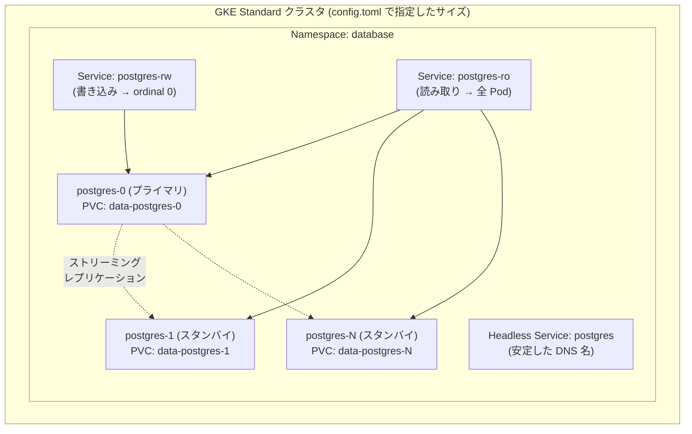

# gke-postgresql-statefulset

GKE Standard クラスタ上に PostgreSQL を **StatefulSet** として、任意のサイズで構築するための Make ベースのツールです。

```console
$ make db          # クラスタが無ければ作り、PostgreSQL StatefulSet を構築する
$ make db-content  # スキーマとダミーデータを投入する (pg_dump 形式からロード)
```

サイズ（ノード数・マシンタイプ・レプリカ数・ディスク容量・CPU / メモリ）とゾーンは、すべて **`config.toml`** で指定します。

---

## 前提

| 必要なもの | 備考 |
| --- | --- |
| `gcloud` | 認証済みであること (`gcloud auth login`) |
| `kubectl` | `gcloud components install kubectl` |
| `python3` | 3.11 以上 (`tomllib` を使用) |
| `make` | GNU Make |

課金が有効な Google Cloud プロジェクトが必要です。プロジェクトは `config.toml` の `[gcp] project` で指定するか、未指定なら `gcloud config get-value project` の値が使われます。

---

## クイックスタート

```console
$ make config          # config.toml.template から config.toml を作る
$ vi config.toml       # サイズやゾーンを調整する
$ make db              # クラスタ作成 (5〜10 分) + StatefulSet デプロイ
$ make db-content      # スキーマ + ダミーデータを投入
$ make psql            # psql で中身を確認する
```

`make db` はクラスタの有無を確認し、**存在しなければ `config.toml` の設定で自動作成**します。既にあれば作成をスキップして認証情報の取得だけ行うので、何度実行しても安全です。

---

## 設定 (`config.toml`)

`config.toml.template` がひな形かつ **デフォルト値の定義そのもの** です。`config.toml` には変更したいキーだけを書けば足り、書かなかったキーはテンプレートの値が使われます。

```toml
[gcp]
project = ""                    # 空なら gcloud config の値
zone    = "asia-northeast1-a"

[cluster]                       # GKE Standard のサイズ
machine_type = "e2-standard-4"
num_nodes    = 3
disk_size_gb = 100

[postgres]                      # PostgreSQL のサイズ
replicas       = 1              # 2 以上でストリーミングレプリケーション構成
storage_size   = "20Gi"
cpu_limit      = "2"
memory_limit   = "4Gi"
shared_buffers = "256MB"
```

主な設定項目:

| セクション | キー | 既定値 | 説明 |
| --- | --- | --- | --- |
| `[gcp]` | `project` | *(gcloud の値)* | プロジェクト ID |
| | `region` / `zone` | `asia-northeast1` / `-a` | 配置先 |
| `[cluster]` | `name` | `pg-cluster` | クラスタ名 |
| | `location_type` | `zonal` | `zonal` / `regional` |
| | `machine_type` | `e2-standard-4` | ノードのマシンタイプ |
| | `num_nodes` | `3` | ノード数 (regional ならゾーンあたり) |
| | `disk_type` / `disk_size_gb` | `pd-balanced` / `100` | ノードのブートディスク |
| | `autoscaling` / `min_nodes` / `max_nodes` | `false` / `1` / `6` | ノードプールの自動スケール |
| | `spot` | `false` | Spot VM でコスト削減 (検証用) |
| `[postgres]` | `replicas` | `1` | 1 = 単体、2 以上 = レプリケーション構成 |
| | `storage_size` / `storage_class` | `20Gi` / `premium-rwo` | PVC のサイズと種別 |
| | `cpu_request` / `cpu_limit` | `500m` / `2` | Pod の CPU |
| | `memory_request` / `memory_limit` | `1Gi` / `4Gi` | Pod のメモリ |
| | `database` / `user` / `password` | `appdb` / `app` / *(自動生成)* | 初期作成される DB とユーザ |
| | `shared_buffers` ほか | `256MB` | `postgresql.conf` のチューニング |
| | `internal_lb` | `false` | 同一 VPC 向けの内部 LoadBalancer |
| `[content]` | `dump_file` | `sql/dump.sql` | `make db-content` が読むファイル |
| | `rows_customers` / `rows_products` / `rows_orders` | `2000` / `500` / `8000` | ダミーデータの行数 |

設定値は起動前に型と書式が検証され、未知のキーや不正な値はエラーになります。

```console
$ make show-config     # 解決後の値をすべて表示
$ make validate        # 設定・マニフェスト・スクリプトをクラスタ無しで検証
```

### 環境変数による一時的な上書き

`config.toml` を書き換えずに、その場限りでサイズを変えられます。

```console
$ CFG_POSTGRES_REPLICAS=3 CFG_CLUSTER_NUM_NODES=5 make db
$ CFG_POSTGRES_STORAGE_SIZE=200Gi make db
```

---

## 構成



* **`replicas = 1`** … 単体構成。`postgres-0` のみが作られます。
* **`replicas >= 2`** … `postgres-0` がプライマリ、`postgres-1` 以降が initContainer 内の `pg_basebackup` でプライマリから複製され、非同期ストリーミングレプリケーションのスタンバイとして起動します。あわせて読み取り用 Service (`-ro`) と PodDisruptionBudget も作られます。

    > 自動フェイルオーバーは行いません。プライマリが失われた場合、StatefulSet は同じ PVC で `postgres-0` を再作成します。自動昇格が必要な場合は CloudNativePG などのオペレータを検討してください。

### ユーザ

| ロール | 用途 |
| --- | --- |
| `postgres` | スーパーユーザ。運用用。 |
| `app` (`[postgres] user`) | アプリ用。`appdb` と `public` スキーマの所有者。**スーパーユーザではありません。** |
| `replicator` | レプリケーション専用。 |

パスワードは `config.toml` で明示するか、未指定なら自動生成され `.secrets/` (gitignore 済み) に保存されます。クラスタ上に Secret が既にある場合はその値が引き継がれるため、再デプロイでパスワードが食い違うことはありません。

---

## `make db-content` — スキーマとダミーデータ

`sql/dump.sql` (pg_dump のプレーン形式) を psql で流し込みます。`--clean --if-exists` 相当の `DROP` から始まるので、**何度実行しても同じ状態になります**。

投入されるのは EC サイト風の 5 テーブルです。

| テーブル | 既定の行数 | 内容 |
| --- | --- | --- |
| `customers` | 2,000 | 顧客 (国・都市つき) |
| `categories` | 8 | 商品カテゴリ |
| `products` | 500 | 商品 (価格・在庫つき) |
| `orders` | 8,000 | 注文 (ステータス・金額つき) |
| `order_items` | 約 24,000 | 注文明細 |

主キー・外部キー・CHECK 制約・インデックス・ビュー (`order_summary`) を含みます。`orders.total_amount` は明細の合計と一致するよう生成されています。

```console
# 行数を変えて再生成する
$ CFG_CONTENT_ROWS_ORDERS=100000 make gen-dump
$ make db-content

# 稼働中の DB から pg_dump を取り直す (sql/dump.sql を上書き)
$ make db-dump
```

自前のスキーマを使いたい場合は、`sql/dump.sql` を差し替えるか `config.toml` の `[content] dump_file` で別のファイルを指定してください。

---

## Make ターゲット

| ターゲット | 説明 |
| --- | --- |
| `make db` | **クラスタ (無ければ作成) + StatefulSet を構築** |
| `make db-content` | **スキーマとダミーデータを投入** |
| `make cluster` | GKE クラスタの用意だけを行う |
| `make status` | Pod / PVC / Service とレプリケーション状態、接続情報を表示 |
| `make psql` | プライマリで psql を開く (`ARGS='-c "SELECT 1"'` を渡せる) |
| `make port-forward` | `localhost:15432` を DB に転送する |
| `make logs` | プライマリのログを追う |
| `make scale N=3` | レプリカ数を変えて再デプロイする (`config.toml` に保存) |
| `make gen-dump` | ダミーデータを再生成する |
| `make db-dump` | 稼働中の DB から `pg_dump` を取得する |
| `make render` | マニフェストを `build/` に生成するだけ (適用しない) |
| `make validate` | 設定・マニフェスト・スクリプトをオフラインで検証する |
| `make show-config` | 解決後の設定値を表示する |
| `make destroy-db` | Namespace ごと DB を削除する (クラスタは残す) |
| `make destroy-cluster` | GKE クラスタごと削除する |

---

## サイズを変更する

| 変更したいもの | 方法 |
| --- | --- |
| レプリカ数 | `[postgres] replicas` を変更 → `make db`。`make scale N=3` は `config.toml` を書き換えてから反映するので、次回以降の `make db` でも維持されます。 |
| ディスク容量 | `[postgres] storage_size` を **増やして** `make db`。既存 PVC は自動で拡張要求されます。<br/>ファイルシステムの拡張完了に Pod の再起動が必要な場合があります (`FileSystemResizePending`)。<br/>Kubernetes は縮小をサポートしないため、減らす場合は `make destroy-db` からの作り直しが必要です。 |
| CPU / メモリ | `[postgres] cpu_limit` などを変更 → `make db` (ローリング再起動) |
| ノード数 / マシンタイプ | `[cluster]` を変更 → 既存クラスタには反映されません。`gcloud container clusters resize` を使うか、`make destroy-cluster` から作り直してください。 |

`storage_class` を変えた場合など `volumeClaimTemplates` に差分があるときは、Pod と PVC を残したまま (`--cascade=orphan`) StatefulSet だけを作り直します。既存の PVC はそのまま使われ、新しく増えた ordinal から新しい設定が適用されます。

---

## ファイル構成

```
Makefile                        エントリポイント
config.toml.template            設定のひな形 兼 デフォルト値の定義
config.toml                     実際の設定 (gitignore)
manifests/
  *.yaml.tmpl                   ${CFG_*} を埋め込む Kubernetes マニフェスト
  pg-scripts/
    init-01-app-user.sh         初回 initdb 時にアプリ用 / レプリケーション用ロールを作る
    bootstrap-replica.sh        initContainer: スタンバイを pg_basebackup で作る
scripts/
  config.py                     config.toml を解決・検証してシェル変数に変換
  render.py                     マニフェストのテンプレート展開
  mk-configmap.py               pg-scripts/ から ConfigMap を生成
  qty.py                        リソース量 (20Gi など) の比較
  set-config.py                 config.toml の 1 キーをコメントを保ったまま書き換える
  ensure-cluster.sh             クラスタの存在確認と自動作成
  deploy-db.sh                  レンダリング → apply → 起動待ち
  load-content.sh               dump.sql の投入
  gen-dump.py                   ダミーデータ生成
  dump-db.sh / psql.sh / status.sh / port-forward.sh / destroy.sh / validate.sh
sql/dump.sql                    スキーマ + ダミーデータ (pg_dump 形式)
build/                          レンダリング結果 (gitignore)
.secrets/                       自動生成したパスワード (gitignore)
```

---

## トラブルシューティング

**Pod が `Pending` のまま**

```console
$ kubectl -n database describe pod postgres-0
```

ノードのリソース不足がよくある原因です。`[postgres] cpu_request` / `memory_request` を下げるか、`[cluster] machine_type` を大きくしてください。

**Pod が `CrashLoopBackOff`**

```console
$ make logs
```

`shared_buffers` がメモリ上限を超えていないか確認してください。目安は `memory_limit` の 25% 程度です。

**スタンバイが起動しない (`replicas >= 2`)**

```console
$ kubectl -n database logs postgres-1 -c bootstrap-replica
```

initContainer の `pg_basebackup` のログが出ます。`replicator` ロールと `pg_hba.conf` の許可行は `replicas` の値によらず初回 initdb 時に必ず作られるので、通常はプライマリの起動待ちかネットワークの問題です。プライマリ側は次で確認できます。

```console
$ make psql ARGS='-c "SELECT usename, client_addr, state FROM pg_stat_replication;"'
```

**`storage_size` を増やしても `CAPACITY` が変わらない**

```console
$ kubectl -n database get pvc data-postgres-0 -o jsonpath='{.status.conditions}'
```

`FileSystemResizePending` が出ている場合、ディスク自体は拡張済みでファイルシステムの拡張待ちです。その Pod を再起動すると完了します。

```console
$ kubectl -n database delete pod postgres-0
```

そもそも拡張が始まらない場合は、StorageClass の `allowVolumeExpansion` が `true` である必要があります (GKE の `standard-rwo` / `premium-rwo` は既定で有効)。

---

## 片付け

```console
$ make destroy-db        # DB だけ削除 (クラスタは残す)
$ make destroy-cluster   # クラスタごと削除
```

どちらも確認のためリソース名の入力を求めます。非対話環境では `ASSUME_YES=1` を付けてください。
