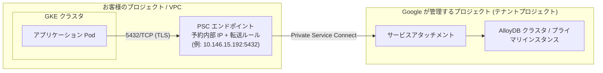
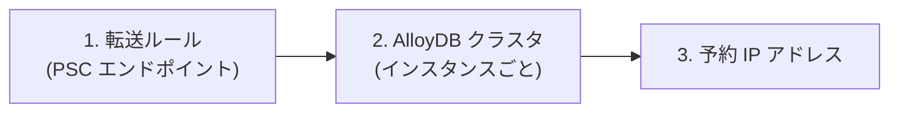

# AlloyDB (最小構成) を Private Service Connect で構築する手順書

このドキュメントは、**Google Cloud の AlloyDB for PostgreSQL を検証用の最小構成で作成し、Private Service Connect (PSC) 経由で GKE 上のアプリケーションから接続できる状態にするまで** の手順を、`gcloud` コマンド単位で説明したものです。

同じ内容は本リポジトリの `make alloydb` で自動実行できますが、本書では **1 つ 1 つのコマンドが何を作り、なぜ必要なのか** を明らかにするため、あえて手動の手順として記載しています。自動化されたコマンドとの対応は [付録 A](#付録-a-make-ターゲットとの対応) をご覧ください。

| 項目 | 内容 |
| --- | --- |
| 対象読者 | Google Cloud のプロジェクトを操作できる方 (インフラ担当者・アプリ開発者) |
| 前提知識 | `gcloud` / `kubectl` の基本操作、PostgreSQL の基本的な用語 |
| 所要時間 | 約 20〜30 分 (うち AlloyDB インスタンスの作成待ちが 10〜15 分) |
| 作成されるもの | AlloyDB クラスタ 1 / インスタンス 1 / 内部 IP 1 / 転送ルール 1 ([付録 D](#付録-d-作成されるリソース一覧)) |
| 費用 | **アクセスがなくても、インスタンスが起動している限り課金されます。** 一時中断は [インスタンスの停止](#インスタンスを停止する--起動する)、検証終了後は [6. リソースの削除](#6-リソースの削除) を実施してください |

---

## 1. 構成の全体像



AlloyDB の実体は **Google が管理するプロジェクト側** で動作しており、お客様の VPC には存在しません。そのため、お客様の VPC から AlloyDB に到達するための「入口」を作る必要があります。本書ではその入口として **Private Service Connect (PSC) エンドポイント** を作成します。

PSC エンドポイントは、お客様の VPC の中に作られる **1 個の内部 IP アドレス** です。アプリケーションはこの IP アドレスの 5432 番ポートに接続するだけで AlloyDB を利用できます。特別なクライアントライブラリやプロキシは不要で、一般的な PostgreSQL の接続文字列がそのまま使えます。

### なぜ Private Service Connect を選ぶのか

AlloyDB への接続方式にはいくつかの選択肢があります。本書で PSC を採用する理由は次の比較のとおりです。

| 接続方式 | 概要 | 本構成で採用しない / する理由 |
| --- | --- | --- |
| **Private Service Connect (本書)** | お客様の VPC に内部 IP を 1 つ作り、そこから AlloyDB に到達する | **採用。** VPC ピアリングも IP 範囲の事前確保も不要で、影響範囲が「作った IP 1 つ」に限定される。複数の VPC・プロジェクトから個別に接続でき、IP アドレスの重複も起きない |
| private services access (VPC ピアリング) | VPC に /16 などの IP 範囲を事前に割り当て、Google 側とピアリングする | VPC 全体の構成変更を伴い、IP 範囲の設計と確保が必要。既存ネットワークへの影響が大きい |
| Public IP | インターネット経由で接続する | AlloyDB では非推奨。ネットワーク的な保護が弱くなる |
| AlloyDB Auth Proxy / 言語コネクタ | 専用のプロキシやライブラリを介して接続する | IAM 認証など高度な要件では有力だが、アプリケーション側に追加コンポーネントが必要。本構成では「普通の PostgreSQL として接続できること」を優先 |

> **補足**: PSC エンドポイントの IP はお客様の VPC 内部からのみ到達できます。インターネットからは到達できないため、データベースが外部に露出することはありません。反面、**手元の PC から直接 psql で接続することもできません**。本書では接続確認に GKE 上の一時的な Pod を使用します。

---

## 2. 前提条件

作業を始める前に、以下が揃っていることをご確認ください。

### 2.1 Google Cloud 側

| 項目 | 確認方法・備考 |
| --- | --- |
| 課金が有効なプロジェクト | `gcloud billing projects describe PROJECT_ID` |
| 接続元となる VPC | 本書では GKE クラスタが使用している VPC (既定では `default`) を使います |
| 接続元となる GKE クラスタ | 接続確認とアプリケーションの実行に使用します。GCE VM でも代替可能です |

### 2.2 必要な IAM ロール

作業を行うアカウントに以下のロール (または同等の権限) が必要です。プロジェクトのオーナー / 編集者であればすべて含まれます。

| ロール | 用途 |
| --- | --- |
| `roles/alloydb.admin` | AlloyDB クラスタ・インスタンスの作成 |
| `roles/compute.networkAdmin` | 内部 IP の予約と転送ルール (PSC エンドポイント) の作成 |
| `roles/container.developer` | 接続確認用の Pod を GKE 上で実行 |
| `roles/serviceusage.serviceUsageAdmin` | API の有効化 |

### 2.3 手元の環境

| ツール | 確認方法 |
| --- | --- |
| `gcloud` | `gcloud version` (認証は `gcloud auth login`) |
| `kubectl` | `kubectl version --client` (未導入なら `gcloud components install kubectl`) |

---

## 3. 変数を設定する

以降のコマンドをそのままコピーして実行できるよう、最初に変数を定義します。**お客様の環境に合わせて値を変更してください。**

```bash
# ---- 基本 ----
export PROJECT_ID="example-project"          # 対象のプロジェクト ID
export REGION="asia-northeast1"              # AlloyDB と PSC エンドポイントを作るリージョン

# ---- AlloyDB ----
export ADB_CLUSTER="alloydb"                 # AlloyDB クラスタ名
export ADB_INSTANCE="alloydb-primary"        # プライマリインスタンス名
export ADB_CPU_COUNT="2"                     # vCPU 数 (最小構成は 2)
export ADB_DB="appdb"                        # アプリケーション用データベース名
export ADB_USER="app"                        # アプリケーション用ユーザ名

# ---- PSC エンドポイント ----
export PSC_NAME="alloydb-psc"                # 予約 IP と転送ルールに付ける名前 (共通)

# ---- 接続元の GKE クラスタ ----
export GKE_CLUSTER="pg-cluster"              # 接続確認に使う GKE クラスタ名
export GKE_LOCATION="asia-northeast1"        # GKE クラスタのリージョン (ゾーンの場合はゾーン名)
```

設定が終わったら、プロジェクトの既定値も揃えておくと以降が安全です。

```bash
gcloud config set project "${PROJECT_ID}"
```

---

## 4. 構築手順

### 手順 1: 必要な API を有効化する

**目的**: AlloyDB とネットワークリソースを操作するための API を使用可能にします。

```bash
gcloud services enable alloydb.googleapis.com compute.googleapis.com \
  --project "${PROJECT_ID}"
```

**確認**:

```bash
gcloud services list --enabled --project "${PROJECT_ID}" \
  --filter='config.name:(alloydb.googleapis.com OR compute.googleapis.com)' \
  --format='value(config.name)'
```

```console
alloydb.googleapis.com
compute.googleapis.com
```

> すでに有効な場合、`enable` コマンドは何もせず正常終了します。繰り返し実行しても問題ありません。

---

### 手順 2: AlloyDB クラスタを作成する

**目的**: データベースの入れ物である「クラスタ」を作成します。この段階ではまだデータベースサーバー (インスタンス) は起動しません。

AlloyDB では **クラスタ = ストレージと構成の単位**、**インスタンス = 実際に処理を行う計算資源** という構成になっています。クラスタ作成時に、管理者ユーザである `postgres` の初期パスワードを設定します。

#### 2-1. postgres ユーザのパスワードを用意する

パスワードがコマンド履歴や `ps` の出力に残らないよう、**ファイル経由で渡す** 方法を推奨します。ここでは英数字 24 文字のパスワードを自動生成します。

```bash
# パスワードを生成してファイルに保存する (権限は本人のみ)
mkdir -p ~/.alloydb-secrets && chmod 700 ~/.alloydb-secrets
python3 -c 'import secrets, string; print("".join(secrets.choice(string.ascii_letters + string.digits) for _ in range(24)))' \
  > ~/.alloydb-secrets/postgres_password
chmod 600 ~/.alloydb-secrets/postgres_password

# gcloud に渡すためのフラグファイルを作る (--password をコマンドラインに書かないため)
python3 -c 'import json, pathlib; print(json.dumps({"--password": pathlib.Path.home().joinpath(".alloydb-secrets/postgres_password").read_text().strip()}))' \
  > ~/.alloydb-secrets/pw-flags.json
chmod 600 ~/.alloydb-secrets/pw-flags.json
```

> **お客様へのご案内**: 本番環境では、パスワードを **Secret Manager** で管理し、アプリケーションからは Workload Identity 経由で取得する運用を推奨します。本書ではローカルファイルに保存していますが、これは検証用の簡易的な方法です。

#### 2-2. クラスタを作成する

```bash
gcloud alloydb clusters create "${ADB_CLUSTER}" \
  --project "${PROJECT_ID}" \
  --region "${REGION}" \
  --database-version POSTGRES_17 \
  --enable-private-service-connect \
  --flags-file ~/.alloydb-secrets/pw-flags.json
```

| フラグ | 意味 |
| --- | --- |
| `--enable-private-service-connect` | **本手順の要**。このクラスタ配下のインスタンスを PSC で公開する設定です。**クラスタ作成時にしか指定できず、後から変更できません** |
| `--database-version` | PostgreSQL の互換バージョン。`POSTGRES_14` 〜 `POSTGRES_18` から選択します |
| `--flags-file` | `--password` の値をファイルから読み込みます |

所要時間は 1〜2 分程度です。

**確認**:

```bash
gcloud alloydb clusters describe "${ADB_CLUSTER}" \
  --region "${REGION}" --project "${PROJECT_ID}" \
  --format='yaml(state, databaseVersion, pscConfig)'
```

```console
databaseVersion: POSTGRES_17
pscConfig:
  pscEnabled: true
  serviceOwnedProjectNumber: '987654321098'
state: READY
```

`pscEnabled: true` になっていることが重要です。ここが `false` または表示されない場合、`--enable-private-service-connect` が付いていません。クラスタを削除して作り直してください。

---

### 手順 3: プライマリインスタンスを作成する

**目的**: 実際に SQL を処理するデータベースサーバーを起動します。

```bash
gcloud alloydb instances create "${ADB_INSTANCE}" \
  --project "${PROJECT_ID}" \
  --region "${REGION}" \
  --cluster "${ADB_CLUSTER}" \
  --instance-type PRIMARY \
  --availability-type ZONAL \
  --cpu-count "${ADB_CPU_COUNT}" \
  --allowed-psc-projects "${PROJECT_ID}"
```

| フラグ | 意味 | 補足 |
| --- | --- | --- |
| `--instance-type PRIMARY` | 読み書き可能なプライマリインスタンス | 読み取り専用の `READ_POOL` を後から追加できます |
| `--availability-type ZONAL` | 単一ノード構成 | 検証用。本番では `REGIONAL` (自動フェイルオーバー付きの HA 構成) を推奨します |
| `--cpu-count 2` | 2 vCPU / 16 GB メモリ | AlloyDB の N2 マシンにおける最小構成です |
| `--allowed-psc-projects` | **PSC エンドポイントの作成を許可するプロジェクト** | ここに指定したプロジェクトからのみ接続の入口を作れます。指定を忘れると手順 4 で接続が拒否されます |

**このコマンドは完了までに 10〜15 分かかります。** 完了を待たずに他の作業を行う場合は `--async` を付けて実行し、`gcloud alloydb operations describe` で進捗を確認してください。

**確認**:

```bash
gcloud alloydb instances describe "${ADB_INSTANCE}" \
  --cluster "${ADB_CLUSTER}" --region "${REGION}" --project "${PROJECT_ID}" \
  --format='yaml(state, instanceType, availabilityType, machineConfig, pscInstanceConfig)'
```

```console
availabilityType: ZONAL
instanceType: PRIMARY
machineConfig:
  cpuCount: 2
pscInstanceConfig:
  allowedConsumerProjects:
  - '123456789012'
  pscDnsName: a1b2c3d4-1111-2222-3333-444455556666.9f8e7d6c-aaaa-bbbb-cccc-ddddeeeeffff.asia-northeast1.alloydb-psc.goog.
  serviceAttachmentLink: https://www.googleapis.com/compute/v1/projects/x1y2z3w4v5u6t7s8p-tp/regions/asia-northeast1/serviceAttachments/alloydb-a1b2c3d4-111-alloydb-primary-sa
state: READY
```

ここで押さえておきたい点が 3 つあります。

1. **`allowedConsumerProjects` はプロジェクト番号で保存されます。** コマンドではプロジェクト ID を指定しましたが、内部的には番号 (例: `123456789012`) に変換されます。値が違って見えても誤りではありません。
2. **`serviceAttachmentLink` が次の手順で必要になります。** これが「Google 側の受け口」の住所です。プロジェクト名が `...-tp` で終わっているのは、Google が管理するテナントプロジェクトであることを示しています。
3. **`pscDnsName` は本書では使用しません。** これは AlloyDB Auth Proxy や言語コネクタ向けの名前で、利用するには Cloud DNS のプライベートゾーンを別途作成する必要があります ([付録 B](#付録-b-構成のバリエーション))。

---

### 手順 4: PSC エンドポイントを作成する

**目的**: お客様の VPC 内に、AlloyDB への「入口」となる内部 IP アドレスを作成します。

この手順は 4 つの小さなステップに分かれます。


#### 4-1. サービスアタッチメントと接続先 VPC を確認する

```bash
# AlloyDB 側の受け口 (サービスアタッチメント) の URL を取得する
export SERVICE_ATTACHMENT="$(gcloud alloydb instances describe "${ADB_INSTANCE}" \
  --cluster "${ADB_CLUSTER}" --region "${REGION}" --project "${PROJECT_ID}" \
  --format='value(pscInstanceConfig.serviceAttachmentLink)')"
echo "${SERVICE_ATTACHMENT}"

# 接続元となる GKE クラスタの VPC とサブネットを取得する
read -r GKE_NETWORK GKE_SUBNET < <(gcloud container clusters describe "${GKE_CLUSTER}" \
  --project "${PROJECT_ID}" --region "${GKE_LOCATION}" \
  --format='value(network, subnetwork)')
export GKE_NETWORK GKE_SUBNET
echo "network=${GKE_NETWORK} subnet=${GKE_SUBNET}"
```

```console
https://www.googleapis.com/compute/v1/projects/x1y2z3w4v5u6t7s8p-tp/regions/asia-northeast1/serviceAttachments/alloydb-a1b2c3d4-111-alloydb-primary-sa
network=default subnet=default
```

> **重要**: PSC エンドポイントは **AlloyDB と同じリージョン** かつ **アプリケーションが動作する VPC** に作成する必要があります。GKE がゾーンクラスタの場合は `--region` を `--zone` に読み替えてください。

#### 4-2. 内部 IP アドレスを予約する

**なぜ予約するのか**: エンドポイントの IP アドレスが後から変わってしまうと、アプリケーションの接続先を書き換える必要が生じます。あらかじめ予約 (静的確保) しておくことで、IP アドレスを固定できます。

```bash
gcloud compute addresses create "${PSC_NAME}" \
  --project "${PROJECT_ID}" \
  --region "${REGION}" \
  --subnet "${GKE_SUBNET}" \
  --description "AlloyDB PSC endpoint for ${ADB_CLUSTER}/${ADB_INSTANCE}"
```

特定の IP アドレスを使いたい場合は `--addresses 10.146.15.192` のように指定できます (サブネットのプライマリ範囲内である必要があります)。省略した場合はサブネットの空きから自動的に割り当てられます。

**確認**:

```bash
export PSC_IP="$(gcloud compute addresses describe "${PSC_NAME}" \
  --project "${PROJECT_ID}" --region "${REGION}" --format='value(address)')"
echo "PSC エンドポイントの IP: ${PSC_IP}"
```

```console
PSC エンドポイントの IP: 10.146.15.192
```

#### 4-3. 転送ルール (エンドポイント本体) を作成する

予約した IP と、手順 4-1 で取得したサービスアタッチメントを結び付けます。**この操作によって初めて通信が可能になります。**

```bash
gcloud compute forwarding-rules create "${PSC_NAME}" \
  --project "${PROJECT_ID}" \
  --region "${REGION}" \
  --network "${GKE_NETWORK}" \
  --address "${PSC_NAME}" \
  --target-service-attachment "${SERVICE_ATTACHMENT}" \
  --allow-psc-global-access
```

| フラグ | 意味 |
| --- | --- |
| `--target-service-attachment` | 接続先の AlloyDB (Google 側の受け口) |
| `--allow-psc-global-access` | 他のリージョンからもこのエンドポイントを利用できるようにします。GKE と AlloyDB が同一リージョンなら必須ではありませんが、将来の構成変更に備えて付けておくことを推奨します |

#### 4-4. 接続が受け入れられたことを確認する

作成直後は接続状態が `PENDING` になることがあります。`ACCEPTED` になれば準備完了です。

```bash
gcloud compute forwarding-rules describe "${PSC_NAME}" \
  --project "${PROJECT_ID}" --region "${REGION}" \
  --format='yaml(name, IPAddress, pscConnectionStatus, allowPscGlobalAccess, network)'
```

```console
IPAddress: 10.146.15.192
allowPscGlobalAccess: true
name: alloydb-psc
network: https://www.googleapis.com/compute/v1/projects/example-project/global/networks/default
pscConnectionStatus: ACCEPTED
```

`pscConnectionStatus` が `ACCEPTED` 以外の場合は [7. トラブルシューティング](#7-トラブルシューティング) をご覧ください。

---

### 手順 5: アプリケーション用のロールとデータベースを作成する

**目的**: アプリケーションが使用する専用ユーザ (`app`) とデータベース (`appdb`) を作成します。

**なぜ専用ユーザを作るのか**: 手順 2 で作成した `postgres` ユーザは管理者権限を持っています。アプリケーションに管理者権限を与えると、不具合や攻撃の影響範囲が大きくなります。必要最小限の権限を持つユーザを別途用意することが推奨されます。

#### 5-1. GKE の認証情報を取得する

PSC エンドポイントの IP は VPC 内からしか到達できないため、GKE 上に一時的な Pod を起動して、その中の `psql` から操作します。

```bash
gcloud container clusters get-credentials "${GKE_CLUSTER}" \
  --project "${PROJECT_ID}" --region "${GKE_LOCATION}"
```

#### 5-2. アプリケーション用のパスワードを生成する

```bash
python3 -c 'import secrets, string; print("".join(secrets.choice(string.ascii_letters + string.digits) for _ in range(24)))' \
  > ~/.alloydb-secrets/app_password
chmod 600 ~/.alloydb-secrets/app_password
```

#### 5-3. ロールとデータベースを作成する

`postgres` ユーザで接続し、以下の SQL を実行します。

```bash
kubectl run alloydb-setup --rm -i --restart=Never --image=postgres:17 \
  --env=PGHOST="${PSC_IP}" \
  --env=PGPORT=5432 \
  --env=PGUSER=postgres \
  --env=PGDATABASE=postgres \
  --env=PGSSLMODE=require \
  --env=PGPASSWORD="$(cat ~/.alloydb-secrets/postgres_password)" \
  -- psql -v ON_ERROR_STOP=1 <<SQL
CREATE ROLE "app" WITH LOGIN PASSWORD '$(cat ~/.alloydb-secrets/app_password)';
GRANT "app" TO CURRENT_USER;
CREATE DATABASE "appdb" OWNER "app";
SQL
```

各行の意味は次のとおりです。

| SQL | 目的 |
| --- | --- |
| `CREATE ROLE "app" WITH LOGIN PASSWORD ...` | アプリケーション用のログインユーザを作成します |
| `GRANT "app" TO CURRENT_USER` | **AlloyDB 固有の必要な手順です。** AlloyDB の `postgres` ユーザは PostgreSQL 本来のスーパーユーザではないため、他のロールを所有者とするデータベースを作るには、いったんそのロールのメンバーになる必要があります |
| `CREATE DATABASE "appdb" OWNER "app"` | アプリケーション用のデータベースを、`app` ユーザ所有で作成します |

#### 5-4. public スキーマの所有者を変更する

**この手順を飛ばすと、アプリケーションがテーブルを作成できません。**

```bash
kubectl run alloydb-setup --rm -i --restart=Never --image=postgres:17 \
  --env=PGHOST="${PSC_IP}" \
  --env=PGPORT=5432 \
  --env=PGUSER=postgres \
  --env=PGDATABASE=appdb \
  --env=PGSSLMODE=require \
  --env=PGPASSWORD="$(cat ~/.alloydb-secrets/postgres_password)" \
  -- psql -v ON_ERROR_STOP=1 -c 'ALTER SCHEMA public OWNER TO "app";'
```

**なぜ必要か**: 通常の PostgreSQL では `public` スキーマの所有者は `pg_database_owner` であり、データベースの所有者になれば自動的にテーブルを作成できます。しかし **AlloyDB では `public` スキーマの所有者が `alloydbsuperuser` に固定** されており、`PUBLIC` に付与されているのは `USAGE` 権限のみです。そのため、データベースの所有者にしただけでは以下のエラーが発生します。

```console
ERROR:  permission denied for schema public
LINE 1: CREATE TABLE public.customers (
                     ^
```

所有者を `app` に移すことで、アプリケーションがテーブルやインデックスを自由に作成できるようになります。

---

### 手順 6: 接続を確認する

アプリケーション用ユーザで接続し、意図した状態になっているかを確認します。

```bash
kubectl run alloydb-check --rm -i --restart=Never --image=postgres:17 \
  --env=PGHOST="${PSC_IP}" \
  --env=PGPORT=5432 \
  --env=PGUSER=app \
  --env=PGDATABASE=appdb \
  --env=PGSSLMODE=require \
  --env=PGPASSWORD="$(cat ~/.alloydb-secrets/app_password)" \
  -- psql \
    -c "SELECT current_database() AS db, current_user AS \"user\", version();" \
    -c "SELECT ssl, version AS tls FROM pg_stat_ssl WHERE pid = pg_backend_pid();" \
    -c "SELECT count(*) AS alloydb_params FROM pg_settings WHERE name LIKE 'alloydb.%';" \
    -c "\dn+ public"
```

```console
  db   | user |                                    version
-------+------+--------------------------------------------------------------------------------
 appdb | app  | PostgreSQL 17.x on x86_64-pc-linux-gnu, compiled by ...
(1 row)

 ssl |   tls
-----+---------
 t   | TLSv1.3
(1 row)

 alloydb_params
----------------
             30
(1 row)

                       List of schemas
  Name  | Owner | Access privileges |      Description
--------+-------+-------------------+------------------------
 public | app   | app=UC/app       +| standard public schema
        |       | =U/app            |
(1 row)
```

**確認すべきポイント**:

| 項目 | 期待値 | 意味 |
| --- | --- | --- |
| `db` / `user` | `appdb` / `app` | 意図したデータベース・ユーザで接続できている |
| `ssl` | `t` (true) | 通信が TLS で暗号化されている (AlloyDB は既定で SSL 必須) |
| `alloydb_params` | 1 以上 | `alloydb.*` の設定項目が存在する = 接続先が確かに AlloyDB である |
| `public` の Owner | `app` | 手順 5-4 が正しく適用されている |

> **セキュリティに関する注意**: 上記のコマンドはパスワードを環境変数として Pod に渡しています。この値は `kubectl get pod -o yaml` で参照できてしまうため、`--rm` により実行後に Pod を削除しています。対話的に操作する場合は `--env=PGPASSWORD=...` を省略し、`-it` を付けて実行すると `psql` がパスワードを入力プロンプトで尋ねます。本番運用では Kubernetes Secret や Secret Manager の利用を推奨します。

---

### 手順 7: アプリケーションから接続する

以上で AlloyDB は利用可能な状態になりました。アプリケーションには以下の情報を設定してください。

| 設定項目 | 値 |
| --- | --- |
| ホスト | PSC エンドポイントの内部 IP (例: `10.146.15.192`) |
| ポート | `5432` |
| データベース名 | `appdb` |
| ユーザ名 | `app` |
| パスワード | 手順 5-2 で生成した値 |
| SSL モード | `require` (AlloyDB は既定で SSL 必須のため) |

接続文字列の例:

```
postgresql://app@10.146.15.192:5432/appdb?sslmode=require
```

本リポジトリのサンプルアプリケーションを使用する場合は、`config.toml` の `[app] target` を `"alloydb"` に変更して再デプロイするだけで、この接続先に切り替わります。

```console
$ make app-target T=alloydb
```

---

## 5. 運用でよく使うコマンド

### 状態を確認する

```bash
# クラスタの状態
gcloud alloydb clusters describe "${ADB_CLUSTER}" --region "${REGION}" --project "${PROJECT_ID}" \
  --format='table(name.basename(), state, databaseVersion, pscConfig.pscEnabled)'

# インスタンスの状態とサイズ
gcloud alloydb instances describe "${ADB_INSTANCE}" --cluster "${ADB_CLUSTER}" \
  --region "${REGION}" --project "${PROJECT_ID}" \
  --format='table(name.basename(), state, instanceType, availabilityType, machineConfig.cpuCount)'

# PSC エンドポイントの状態
gcloud compute forwarding-rules describe "${PSC_NAME}" --project "${PROJECT_ID}" --region "${REGION}" \
  --format='table(name, IPAddress, pscConnectionStatus, allowPscGlobalAccess)'
```

### インスタンスを停止する / 起動する

検証を一時的に中断する場合は、インスタンスを停止することで **コンピューティング (vCPU / メモリ) の課金を止められます**。データはそのまま保持されます。

```bash
# 停止する
gcloud alloydb instances update "${ADB_INSTANCE}" \
  --cluster "${ADB_CLUSTER}" --region "${REGION}" --project "${PROJECT_ID}" \
  --activation-policy NEVER

# 再開する
gcloud alloydb instances update "${ADB_INSTANCE}" \
  --cluster "${ADB_CLUSTER}" --region "${REGION}" --project "${PROJECT_ID}" \
  --activation-policy ALWAYS
```

| 状態 | アプリケーションからの接続 | 課金 |
| --- | --- | --- |
| `ALWAYS` (稼働中) | 可能 | vCPU / メモリ + ストレージ + バックアップ |
| `NEVER` (停止中) | 不可 (接続は拒否されます) | ストレージ + バックアップのみ |

> **停止・起動を行っても PSC エンドポイントの IP アドレスは変わりません。** アプリケーション側の接続設定を変更する必要はありません。
>
> ストレージとバックアップの課金は停止中も継続します。費用を完全に止めるにはクラスタごと削除してください ([6. リソースの削除](#6-リソースの削除))。

### インスタンスのサイズを変更する

```bash
gcloud alloydb instances update "${ADB_INSTANCE}" \
  --cluster "${ADB_CLUSTER}" --region "${REGION}" --project "${PROJECT_ID}" \
  --cpu-count 4
```

> サイズ変更中は数分程度の再起動を伴います。業務時間外の実施を推奨します。

### 接続を許可するプロジェクトを追加する

```bash
gcloud alloydb instances update "${ADB_INSTANCE}" \
  --cluster "${ADB_CLUSTER}" --region "${REGION}" --project "${PROJECT_ID}" \
  --allowed-psc-projects "${PROJECT_ID},another-project"
```

---

## 6. リソースの削除

**AlloyDB のインスタンスは、アクセスがなくても起動している限り課金されます。** 検証が終わりましたら削除してください。

> 後日また使う予定がある場合は、削除せずに [インスタンスを停止する](#インスタンスを停止する--起動する) 方法もあります。停止中は計算資源の課金が止まり、データは保持されます (ストレージとバックアップの課金は継続します)。

**削除は以下の順序で行ってください。** 順序を誤ると「使用中のため削除できません」というエラーが発生します。



```bash
# 1. 転送ルール (PSC エンドポイント) を削除する
gcloud compute forwarding-rules delete "${PSC_NAME}" \
  --project "${PROJECT_ID}" --region "${REGION}" --quiet

# 2. AlloyDB クラスタを削除する (--force で配下のインスタンスも同時に削除)
gcloud alloydb clusters delete "${ADB_CLUSTER}" \
  --project "${PROJECT_ID}" --region "${REGION}" --force --quiet

# 3. 予約していた内部 IP を解放する
gcloud compute addresses delete "${PSC_NAME}" \
  --project "${PROJECT_ID}" --region "${REGION}" --quiet
```

**確認**:

```bash
gcloud alloydb clusters list --project "${PROJECT_ID}" --region "${REGION}"
gcloud compute forwarding-rules list --project "${PROJECT_ID}" --filter="name=${PSC_NAME}"
gcloud compute addresses list --project "${PROJECT_ID}" --filter="name=${PSC_NAME}"
```

いずれも該当なし (`Listed 0 items.`) となれば削除完了です。ローカルに保存したパスワードファイル (`~/.alloydb-secrets/`) も不要であれば削除してください。

> **データの保全について**: `--force` を付けたクラスタ削除は、**データベースの内容を完全に削除します。復元はできません。** 必要なデータは事前に `pg_dump` などで取得してください。

---

## 7. トラブルシューティング

### `permission denied for schema public` と表示される

```console
ERROR:  permission denied for schema public
LINE 1: CREATE TABLE public.customers (
```

**原因**: 手順 5-4 (`ALTER SCHEMA public OWNER TO "app"`) が未実施です。AlloyDB では `public` スキーマの所有者が `alloydbsuperuser` になっているため、データベースの所有者であってもテーブルを作成できません。

**対処**: 手順 5-4 を実行してください。現在の所有者は以下で確認できます。

```bash
kubectl run alloydb-check --rm -i --restart=Never --image=postgres:17 \
  --env=PGHOST="${PSC_IP}" --env=PGUSER=postgres --env=PGDATABASE=appdb \
  --env=PGSSLMODE=require --env=PGPASSWORD="$(cat ~/.alloydb-secrets/postgres_password)" \
  -- psql -c "SELECT nspname, pg_get_userbyid(nspowner) AS owner FROM pg_namespace WHERE nspname='public';"
```

### `pscConnectionStatus` が `ACCEPTED` にならない

| 状態 | 原因と対処 |
| --- | --- |
| `PENDING` | 反映待ちです。1〜2 分待って再確認してください |
| `REJECTED` | インスタンスの `--allowed-psc-projects` に、エンドポイントを作成したプロジェクトが含まれていません。下記コマンドで追加してください |
| `NEEDS_ATTENTION` | サービスアタッチメント側の構成に問題があります。インスタンスの状態 (`state: READY`) を確認してください |

```bash
gcloud alloydb instances update "${ADB_INSTANCE}" \
  --cluster "${ADB_CLUSTER}" --region "${REGION}" --project "${PROJECT_ID}" \
  --allowed-psc-projects "${PROJECT_ID}"
```

### Pod から接続できない (タイムアウトする)

以下を順に確認してください。

1. **エンドポイントと Pod が同じ VPC にあるか**

   ```bash
   gcloud compute forwarding-rules describe "${PSC_NAME}" --project "${PROJECT_ID}" --region "${REGION}" --format='value(network)'
   gcloud container clusters describe "${GKE_CLUSTER}" --project "${PROJECT_ID}" --region "${GKE_LOCATION}" --format='value(network)'
   ```

   両者が一致している必要があります。

2. **リージョンが一致しているか**: PSC エンドポイントは AlloyDB と同じリージョンに作成する必要があります。別リージョンの GKE から使う場合は `--allow-psc-global-access` が必要です。

3. **エグレスのファイアウォールルール**: 既定の VPC では VPC 内への通信は許可されていますが、独自のファイアウォールポリシーで下り (egress) を制限している場合は、エンドポイントの IP への 5432/TCP を許可してください。

### Pod が `Pending` のまま起動しない

GKE Autopilot では、Pod の要求に見合うノードが用意されるまで 1〜2 分かかります。初回はこれが通常の動作です。それ以上続く場合は `kubectl describe pod <名前>` の `Events` をご確認ください。

### `Autopilot updated Pod ...` という警告が表示される

```console
Warning: autopilot-default-resources-mutator:Autopilot updated Pod app/alloydb-setup: defaulted unspecified 'cpu' resource for containers
```

`kubectl run` でリソース要求を指定していないため、Autopilot が既定値を補ったという通知です。**エラーではありません。** そのまま処理は継続されます。

### `INVALID_ARGUMENT: Invalid value for field 'password'` と表示される

パスワードに使用できない文字が含まれているか、フラグファイルの JSON が壊れています。手順 2-1 の方法で英数字のみのパスワードを生成し直してください。

---

## 付録 A: make ターゲットとの対応

本リポジトリでは、本書の手順 1〜5 を `make alloydb` の 1 コマンドで実行できます。対応は以下のとおりです。

| 本書の手順 | 対応する make ターゲット | 実装箇所 |
| --- | --- | --- |
| 手順 1: API 有効化 | `make alloydb` | `scripts/ensure-alloydb.sh` (`enable_apis`) |
| 手順 2: クラスタ作成 | `make alloydb` | 同上。パスワードは自動生成され `.secrets/alloydb_superuser_password` に保存されます |
| 手順 3: インスタンス作成 | `make alloydb` | 同上。サイズと接続プーリングは `config.toml` の `[alloydb]` で指定します |
| 手順 4: PSC エンドポイント作成 | `make alloydb` | 同上。GKE クラスタの VPC を自動的に判別します |
| 手順 5: ロール / DB 作成 | `make alloydb` | 同上。一時 Pod を自動生成・自動削除します |
| 手順 6: 接続確認 | `make alloydb-status` / `make alloydb-psql` | `scripts/alloydb-status.sh` |
| 手順 7: アプリ接続 | `make app-target T=alloydb` | `scripts/deploy-app.sh` |
| データ投入 | `make alloydb-content` | `scripts/alloydb-content.sh` |
| 6. 削除 | `make destroy-alloydb` | `scripts/destroy.sh` |

`make alloydb` は **冪等** です。既に存在するリソースは作成をスキップするため、途中で失敗した場合もそのまま再実行できます。

---

## 付録 B: 構成のバリエーション

### より安価な構成 (1 vCPU)

C4A (Google Axion) に対応したリージョンでは、1 vCPU / 8 GB の検証用シェイプを利用できます。

```bash
gcloud alloydb instances create "${ADB_INSTANCE}" \
  --project "${PROJECT_ID}" --region "${REGION}" --cluster "${ADB_CLUSTER}" \
  --instance-type PRIMARY --availability-type ZONAL \
  --machine-type c4a-highmem-1 --cpu-count 1 \
  --allowed-psc-projects "${PROJECT_ID}"
```

**対応リージョン**: `asia-east1`, `asia-southeast1`, `us-central1`, `us-east1`, `us-east4`, `europe-west1`, `europe-west2`, `europe-west3`, `europe-west4`

> `asia-northeast1` (東京) では 1 vCPU シェイプを利用できません。東京リージョンでの最小構成は 2 vCPU となります。

### マネージド接続プーリングを有効にする

インスタンス上でプーラー (PgBouncer 互換) を動かし、接続の確立コストを下げます。**AlloyDB の既定は無効** です。短命な接続が多いアプリケーションや、接続数が急増しうるワークロードに向いています。

```bash
# 作成時に有効にする
gcloud alloydb instances create "${ADB_INSTANCE}" \
  --project "${PROJECT_ID}" --region "${REGION}" --cluster "${ADB_CLUSTER}" \
  --instance-type PRIMARY --availability-type ZONAL --cpu-count "${ADB_CPU_COUNT}" \
  --allowed-psc-projects "${PROJECT_ID}" \
  --enable-connection-pooling \
  --connection-pooling-pool-mode TRANSACTION

# 既存インスタンスで有効にする
gcloud alloydb instances update "${ADB_INSTANCE}" \
  --cluster "${ADB_CLUSTER}" --region "${REGION}" --project "${PROJECT_ID}" \
  --enable-connection-pooling

# 状態を確認する (有効なら True)
gcloud alloydb instances describe "${ADB_INSTANCE}" \
  --cluster "${ADB_CLUSTER}" --region "${REGION}" --project "${PROJECT_ID}" \
  --format='value(connectionPoolConfig.enabled)'

# 無効にする (6432 への既存接続はすべて切断されます)
gcloud alloydb instances update "${ADB_INSTANCE}" \
  --cluster "${ADB_CLUSTER}" --region "${REGION}" --project "${PROJECT_ID}" \
  --no-enable-connection-pooling
```

有効にするときは、以下にご注意ください。

| 項目 | 内容 |
| --- | --- |
| **ポート** | プーラーは **6432** で待ち受けます。5432 の直結はそのまま残るので、アプリケーションの接続先ポートを変えない限りプーリングは効きません |
| モード | 既定は `transaction`。`--connection-pooling-pool-mode SESSION` も選べます。**gcloud のフラグは `TRANSACTION` / `SESSION` と大文字で指定します** (API が返す値は小文字です) |
| `transaction` モードの制約 | `SET`/`RESET`、`LISTEN`、`WITH HOLD CURSOR`、`PREPARE`/`DEALLOCATE`、`PRESERVE`/`DELETE ROW` の一時テーブル、`LOAD`、セッションレベルの advisory lock、プロトコルレベルの prepared statement が使えません |
| prepared statement | `--connection-pooling-max-prepared-statements` の既定は **0** です。`transaction` モードで使うなら 1 以上にします |
| 対応する接続方式 | public IP は非対応です。Private Service Connect は対応しています |
| ロール | `REPLICATION` 権限を持つユーザからの接続は非対応です |
| SSL | インスタンスの SSL モードがそのままプーラーにも適用されます (`sslmode=require` のままで問題ありません) |
| 統計 | ポート 6432 の `alloydb_mcp_stats_<N>` データベースに接続すると `SHOW POOLS;` などの PgBouncer 互換コマンドが使えます。事前に `--connection-pooling-stats-users` で接続を許可するユーザを指定してください |

> **本書の手順 5 (ロールとデータベースの作成) と、`pg_dump` 形式のファイルの投入は 5432 の直結で行ってください。** これらは `SET` を含むため、`transaction` モードのプーラー越しでは失敗します。

### 本番向けの高可用性構成

```bash
gcloud alloydb instances create "${ADB_INSTANCE}" \
  --project "${PROJECT_ID}" --region "${REGION}" --cluster "${ADB_CLUSTER}" \
  --instance-type PRIMARY --availability-type REGIONAL \
  --cpu-count 4 \
  --allowed-psc-projects "${PROJECT_ID}"
```

`REGIONAL` では別ゾーンにスタンバイノードが配置され、障害時に自動フェイルオーバーします。費用はおよそ 2 倍になります。

### DNS 名で接続する

IP アドレスではなく `pscDnsName` (`*.alloydb-psc.goog`) で接続したい場合は、Cloud DNS のプライベートゾーンを作成し、A レコードで PSC エンドポイントの IP を指します。AlloyDB Auth Proxy や言語コネクタを利用する場合はこの設定が必要です。

```bash
export DNS_NAME="$(gcloud alloydb instances describe "${ADB_INSTANCE}" \
  --cluster "${ADB_CLUSTER}" --region "${REGION}" --project "${PROJECT_ID}" \
  --format='value(pscInstanceConfig.pscDnsName)')"

gcloud dns managed-zones create alloydb-psc-zone \
  --project "${PROJECT_ID}" \
  --description "AlloyDB PSC private zone" \
  --dns-name "${DNS_NAME}" \
  --networks "${GKE_NETWORK}" \
  --visibility private

gcloud dns record-sets create "${DNS_NAME}" \
  --project "${PROJECT_ID}" --type A --rrdatas "${PSC_IP}" \
  --zone alloydb-psc-zone
```

### エンドポイントを自動作成する

サービス接続ポリシー (service connection policy) を事前に作成しておけば、`--psc-auto-connections` によって AlloyDB 側にエンドポイントを自動生成させることもできます。VPC やプロジェクトが多数ある場合に有効です。

```bash
gcloud alloydb instances update "${ADB_INSTANCE}" \
  --cluster "${ADB_CLUSTER}" --region "${REGION}" --project "${PROJECT_ID}" \
  --psc-auto-connections "network=projects/${PROJECT_ID}/global/networks/default,project=${PROJECT_ID}"
```

本書では、構成が明示的で追跡しやすい **手動作成** を採用しています。

---

## 付録 C: 費用の考え方

AlloyDB の費用は主に以下の要素で構成されます (詳細および最新の単価は [AlloyDB の料金](https://cloud.google.com/alloydb/pricing) をご確認ください)。

| 項目 | 課金の考え方 | 本構成での該当 |
| --- | --- | --- |
| インスタンス (vCPU / メモリ) | **起動している時間** に対して課金。アクセスの有無は無関係 | 2 vCPU × 稼働時間 |
| ストレージ | 実際に使用した容量 | データ量に応じて |
| バックアップ | 保存容量 | 継続的バックアップが既定で有効 |
| ネットワーク | 同一リージョン内の通信は無償 | GKE ↔ AlloyDB は同一リージョンのため対象外 |
| PSC エンドポイント | 転送ルール 1 つあたりの時間課金 + 処理データ量 | 1 個 |

**コストを抑えるための要点**:

- 使わない期間は **インスタンスを停止** してください (`--activation-policy NEVER`)。停止中は vCPU / メモリの課金が止まります。ただし **ストレージとバックアップの課金は継続** します。
- データが不要になったら **クラスタごと削除** してください。これですべての課金が停止します。
- 開発用途では `--availability-type ZONAL` (単一ノード) を使用してください。`REGIONAL` は約 2 倍の費用となります。
- C4A 対応リージョンであれば 1 vCPU シェイプで更に費用を抑えられます ([付録 B](#付録-b-構成のバリエーション))。

---

## 付録 D: 作成されるリソース一覧

本手順で作成されるリソースは以下のとおりです。棚卸しや削除漏れの確認にご利用ください。

| # | 種別 | 名前 (既定) | 所在 | 課金 |
| --- | --- | --- | --- | --- |
| 1 | AlloyDB クラスタ | `alloydb` | `asia-northeast1` | ストレージ・バックアップ |
| 2 | AlloyDB インスタンス | `alloydb-primary` | クラスタ配下 | **vCPU / メモリ (稼働中は常時)** |
| 3 | 内部 IP アドレス (予約) | `alloydb-psc` | VPC `default` / `asia-northeast1` | 使用中は無償 |
| 4 | 転送ルール (PSC エンドポイント) | `alloydb-psc` | VPC `default` / `asia-northeast1` | 時間課金 + 処理データ量 |
| 5 | データベース | `appdb` | AlloyDB 内 | ストレージに含む |
| 6 | ロール | `app` | AlloyDB 内 | — |

以下は Google が管理するプロジェクト側に自動作成されるもので、お客様が直接操作・削除することはありません。

| 種別 | 備考 |
| --- | --- |
| サービスアタッチメント | AlloyDB クラスタの削除に伴い自動的に削除されます |

---

## 関連ドキュメント

- [AlloyDB for PostgreSQL のドキュメント](https://cloud.google.com/alloydb/docs)
- [Private Service Connect を使用して接続する](https://cloud.google.com/alloydb/docs/configure-private-service-connect)
- [AlloyDB のマシンタイプを選択する](https://cloud.google.com/alloydb/docs/choose-machine-type)
- [インスタンスを開始、停止、再起動する](https://cloud.google.com/alloydb/docs/instance-start-stop-restart)
- [マネージド接続プーリングを構成する](https://cloud.google.com/alloydb/docs/configure-managed-connection-pooling)
- [Private Service Connect の概要](https://cloud.google.com/vpc/docs/private-service-connect)
- 本リポジトリの [README.md](../README.md) — `make` による自動化された手順
