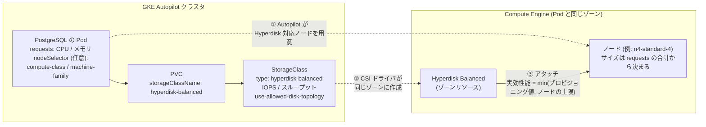

# GKE Autopilot で Hyperdisk Balanced を使う — N4 と Performance コンピュートクラスの調査メモ

PostgreSQL の StatefulSet を **Hyperdisk Balanced** のボリュームで動かすにあたり、GKE Autopilot での使い方と制約を調べた記録です。とくに次の 3 点を確認しました。

1. Hyperdisk Balanced は Performance コンピュートクラスの N4 ノードで使えるか
2. N4 ノードのサイズとディスク性能の関係
3. Autopilot では N4 のサイズをどう決めるのか (Pod の CPU / メモリで指定するのか)

根拠は Google Cloud の公式ドキュメントと `gcloud` の出力です。参照したページは末尾の [参照したドキュメント](#参照したドキュメント) にまとめています。数値や対応表は調査日時点のもので、今後変わる可能性があります。本リポジトリでの設定方法は README の [Hyperdisk Balanced](../README.md#hyperdisk-balanced) を参照してください。

| 項目 | 内容 |
| --- | --- |
| 調査日 | 2026-09-16 |
| 対象 | GKE Autopilot、Compute Engine の Hyperdisk Balanced と N4 マシンシリーズ |
| リージョン | `asia-northeast1` (東京) |
| GKE バージョン | `1.35.7-gke.1222000` (このリージョンの REGULAR チャンネルの既定。検証用クラスタも同じ) |
| 実機での確認 | 未実施。マニフェストの生成と `make validate` による検証のみ ([未確認の事項](#未確認の事項)) |

---

## 結論

| 問い | 答え |
| --- | --- |
| Hyperdisk Balanced は Performance コンピュートクラスの N4 で使えるか | **使えます。** N4 は Persistent Disk を一切使えないため、N4 に載せる Pod のボリュームは Hyperdisk が必須です。 |
| プロビジョニングした性能はそのまま出るか | **ノードのマシンタイプの上限で頭打ちになります。** `n4-standard-2` / `n4-standard-4` のスループット上限は 240 MiB/s です。 |
| Autopilot で N4 のサイズはどう指定するか | **Pod の CPU / メモリの requests で決まります。** マシンタイプを直接書く場所はありません。固定したいときはカスタム ComputeClass を使います。 |
| 課金はどうなるか | マシンシリーズや Performance を指定すると、**Compute Engine の VM 単位の課金 + Autopilot の管理料**になります。 |
| カスタム ComputeClass で注意することは | Pod に `machine-family` や `gke-spot` の nodeSelector を併記すると **GKE が Pod を拒否します。** ComputeClass 側で指定します。 |

---

## 1. 全体像



1. `volumeBindingMode: WaitForFirstConsumer` なので、ディスクは Pod の配置先が決まるまで作られません。Autopilot は Pod の requests と nodeSelector、StorageClass の条件をすべて満たすノードを用意します。
2. Compute Engine Persistent Disk CSI ドライバが、そのノードと同じゾーンに Hyperdisk Balanced を作成します。
3. ディスクをノードにアタッチします。実際に出る性能は、ディスクにプロビジョニングした値とノードのマシンタイプの上限のうち小さい方です。

---

## 2. Hyperdisk Balanced 用の StorageClass

本リポジトリが生成する StorageClass (`build/05-storageclass.yaml`) は、IOPS とスループットを指定した場合に次の内容になります (実際のファイルでは `parameters` を 1 行のフローマッピングで書き出します)。

```yaml
apiVersion: storage.k8s.io/v1
kind: StorageClass
metadata:
  name: hyperdisk-balanced
provisioner: pd.csi.storage.gke.io
volumeBindingMode: WaitForFirstConsumer
allowVolumeExpansion: true
parameters:
  type: hyperdisk-balanced
  use-allowed-disk-topology: "true"
  provisioned-iops-on-create: "10000"
  provisioned-throughput-on-create: "250Mi"
```

| フィールド | 値 | 意味 |
| --- | --- | --- |
| `provisioner` | `pd.csi.storage.gke.io` | Compute Engine Persistent Disk CSI ドライバ。Hyperdisk もこのドライバが扱います。 |
| `volumeBindingMode` | `WaitForFirstConsumer` | Pod の配置先が決まってから、そのゾーンにディスクを作ります。 |
| `allowVolumeExpansion` | `true` | PVC の容量を後から増やせます。 |
| `type` | `hyperdisk-balanced` | ディスクの種類。ほかに `hyperdisk-balanced-high-availability` / `hyperdisk-throughput` / `hyperdisk-extreme` / `hyperdisk-ml` があります。 |
| `provisioned-iops-on-create` | `"10000"` | 作成時の IOPS。単位は付けません。省略すると容量から決まる既定値になります。 |
| `provisioned-throughput-on-create` | `"250Mi"` | 作成時のスループット (MiB/s)。`Mi` を付けます。省略すると容量から決まる既定値になります。 |
| `use-allowed-disk-topology` | `"true"` | この StorageClass の PVC を使う Pod を、Hyperdisk をアタッチできるノードにだけ配置します。 |

### 要件

- GKE 1.26 以降の Linux クラスタであること (Hyperdisk Balanced High Availability は 1.33 以降)。
- Compute Engine Persistent Disk CSI ドライバが有効であること。Autopilot では常に有効で、無効化も変更もできません。
- `use-allowed-disk-topology` を使う場合は、クラスタとノードプールが `1.34.1-gke.2541000` 以降であること。これより古いノードプールには、この StorageClass のボリュームを持つ Pod は配置されません。`make db` は適用前にクラスタとノードのバージョンを確認します。

### 作成後に変えられないもの

- **StorageClass の `parameters` は作成後に変更できません** (Kubernetes の仕様)。値を変えるには StorageClass を削除して作り直します。作成済みのボリュームは影響を受けず、作成時の値のまま動きます。
- **作成済みボリュームの IOPS とスループットは Compute Engine 側で変更します** ([10. 確認用のコマンド](#10-確認用のコマンド))。性能の変更は 4 時間に 1 回までで、反映に最大 15 分かかります。容量の変更は 4 時間に 2 回までです。

### 採用しなかった選択肢: `type: dynamic`

GKE `1.35.3-gke.1290000` 以降では、`type: dynamic` を指定するとノードのマシンタイプに応じて Hyperdisk と Persistent Disk を自動で選ばせることができます (`hyperdisk-type` / `pd-type` / `disk-type-preference`)。ただし GKE は選ばれたディスク種別に対応するパラメータしか適用しないため、Persistent Disk が選ばれると IOPS やスループットの指定は無視されます。性能を明示的に決めたい今回の用途には合わないため、本リポジトリでは `type: hyperdisk-balanced` に固定しています。

---

## 3. 容量・性能の範囲と課金

### 指定できる範囲

| 項目 | 範囲 |
| --- | --- |
| 容量 | 4 GiB 〜 64 TiB |
| IOPS | 3,000 〜 min(500 × 容量 GiB, 160,000)。4 GiB と 5 GiB は 2,000 / 2,500 IOPS に固定 |
| スループット | max(140, IOPS ÷ 256) 〜 min(2,400, IOPS ÷ 4) MiB/s |

### 省略したときの既定値

| 項目 | 既定値 (x は容量 GiB) |
| --- | --- |
| IOPS | 6x + 3,000 (6 GiB 以下は 500x、26.67 TiB を超えると 160,000) |
| スループット | min(2,400, 1.5x + 140) MiB/s (6 GiB 以下は 140) |

計算例:

| 容量 | 指定できる IOPS | 既定の IOPS | 既定のスループット |
| --- | --- | --- | --- |
| 20 GiB | 3,000 〜 10,000 | 3,120 | 170 MiB/s |
| 150 GiB | 3,000 〜 75,000 | 3,900 | 365 MiB/s |
| 320 GiB | 3,000 〜 160,000 | 4,920 | 620 MiB/s |

10,000 IOPS を指定するには 20 GiB 以上が必要です (15 GiB では上限が 7,500 IOPS)。`make validate` と `make db` は、これらの範囲を設定の時点で確認します。

### 課金

- 容量 (GiB あたりの月額) に加え、**3,000 IOPS と 140 MiB/s を超えてプロビジョニングした分**に月額がかかります。この範囲まではベースラインとして無料です。
- 課金はプロビジョニングした値に対して発生し、ディスクをアタッチしていなくても、インスタンスが停止していても続きます。
- 確約利用割引 (CUD) と継続利用割引 (SUD) の対象外です。Spot VM と組み合わせても、ディスクの料金は割り引かれません。
- プロジェクトには Hyperdisk Balanced の IOPS / スループットの割り当て量 (quota) があります。ベースライン分は割り当て量を消費しません。

---

## 4. マシンシリーズとの対応

### Hyperdisk Balanced をアタッチできるシリーズ

| 区分 | マシンシリーズ |
| --- | --- |
| 使える | N4 / N4A / N4D、C3 / C3D、C4 / C4A / C4D / C4N、H3 / H4D、M1 / M2 / M3 / M4 / M4N、Z3、X4、A3 / A4 / A4X、G4 |
| アカウントチームへの依頼が必要 | E2、N1、N2、N2D、C2D |
| 使えない | C2、T2A、T2D、A2、G2、N1 + GPU |

### Persistent Disk を使えないシリーズ

次のシリーズは Persistent Disk (`pd-standard` / `pd-balanced` / `pd-ssd` / `pd-extreme`) をまったく使えず、起動ディスクも Hyperdisk になります。

- N4 / N4A / N4D
- C4 / C4A / C4D / C4N
- H4D、M4 / M4N、X4、G4、A3 (H200) / A4 / A4X

N4 で使えるディスクは Hyperdisk Balanced、Hyperdisk Balanced High Availability、Hyperdisk Throughput の 3 種類です。ディスクのインターフェースは NVMe だけで、Local SSD も使えません。なお Z3 (VM) は `pd-balanced` と `pd-ssd` を、H3 は `pd-balanced` を使えます。

### Autopilot のコンピュートクラスとの組み合わせ

| Autopilot での指定 | 使われるマシンシリーズ | Hyperdisk Balanced | 課金 |
| --- | --- | --- | --- |
| 指定なし | 汎用シリーズから GKE が選ぶ | 使える。Hyperdisk のボリュームを持つ Pod は C3 などの新しいシリーズに配置される | Pod の requests 単位 |
| `Balanced` | N2 / N2D | 使えない (アカウントチームへの依頼が必要なシリーズ) | Pod の requests 単位 |
| `Scale-Out` | T2A / T2D | 使えない | Pod の requests 単位 |
| `machine-family` のみ | 指定したシリーズ (同じシリーズを要求する Pod とノードを共有) | シリーズが対応していれば使える | ノード単位 |
| `Performance` (+ `machine-family`) | 指定したシリーズの専用ノード。シリーズ省略時は C4 | シリーズが対応していれば使える | ノード単位 |
| カスタム ComputeClass | `priorities` で指定したシリーズ / マシンタイプ | シリーズが対応していれば使える | ハードウェアを指定するルールならノード単位 |

逆に、新しいシリーズ (C3 など) を明示した Pod に古い Persistent Disk (`pd-standard` など) のボリュームを付けると、両方の条件を満たすノードが無いため、Pod は `Pending` のままになります。

---

## 5. Performance コンピュートクラスと N4

### nodeSelector

```yaml
spec:
  template:
    spec:
      nodeSelector:
        cloud.google.com/compute-class: "Performance"
        cloud.google.com/machine-family: "n4"
```

GKE の Hyperdisk のドキュメントは、Autopilot でコンピュートクラスと Hyperdisk Balanced を組み合わせる例としてこの形 (`Performance` + `machine-family`) を示しています。条件は、ノードのマシンタイプが **Hyperdisk とコンピュートクラスの両方に対応していること**です。N4 はどちらも満たします。

### 分かったこと

- **N4 は Performance クラスの対応シリーズです。** `machine-family` セレクタの対応表に `n4` があり、Performance クラスの Pod あたりの CPU 上限は N4 で 78 vCPU です。最小の requests は強制されません。
- **`Performance` を付けると Pod ごとに専用ノードになります。** Autopilot は Pod と DaemonSet の requests を計算してノードを用意し、他の Pod が載らないよう Pod に nodeSelector と toleration を追加します。
- **`machine-family` だけなら、同じシリーズを要求する Pod 同士でノードを共有します。**
- **`machine-family` を省略した Performance は C4 になります** (リージョンで C4 が提供されている場合)。
- **Spot Pod と併用できます** (`cloud.google.com/gke-spot: "true"`)。拡張実行時間 Pod とは併用できません。
- マシンシリーズの選択には、Autopilot クラスタが `1.30.1-gke.1396000` 以降である必要があります。
- **課金はノード単位です。** マシンシリーズや Performance を選んだ Pod は、Compute Engine の VM (と付随するハードウェア) の料金に Autopilot の管理料が加わります。Pod の requests で課金されるのは、汎用プラットフォームと `Balanced` / `Scale-Out` の Pod です。

### 東京リージョンでの提供状況

`gcloud compute machine-types list` で確認したところ、`asia-northeast1-a` / `-b` / `-c` の 3 ゾーンすべてで `n4-standard-2` 〜 `n4-standard-80` が提供されていました (2026-09-16 時点)。大阪 (`asia-northeast2`) とソウル (`asia-northeast3`) の各ゾーンにも N4 があります。

```console
$ gcloud compute machine-types list \
    --zones asia-northeast1-a,asia-northeast1-b,asia-northeast1-c \
    --filter="name~^n4-standard-" --format="value(zone,name)"
```

---

## 6. N4 のサイズとディスク性能の上限

Hyperdisk Balanced の性能は、アタッチ先のマシンタイプごとの上限を超えられません。N4 の上限は次のとおりです。上限は vCPU 数で決まり、`n4-highcpu-*` / `n4-highmem-*` も同じ vCPU 数なら同じ値です。

| マシンタイプ | vCPU | メモリ | 最大 IOPS | 最大スループット |
| --- | --- | --- | --- | --- |
| `n4-standard-2` | 2 | 8 GiB | 30,000 | 240 MiB/s |
| `n4-standard-4` | 4 | 16 GiB | 30,000 | 240 MiB/s |
| `n4-standard-8` | 8 | 32 GiB | 30,000 | 480 MiB/s |
| `n4-standard-16` | 16 | 64 GiB | 80,000 | 1,200 MiB/s |
| `n4-standard-32` | 32 | 128 GiB | 100,000 | 1,600 MiB/s |
| `n4-standard-48` / `-64` / `-80` | 48 / 64 / 80 | 192 / 256 / 320 GiB | 160,000 | 2,400 MiB/s |

注意点:

- **上限はノード単位で、そのノードに付いたすべての Hyperdisk Balanced ボリュームの合計に適用されます。** ノードを共有する場合は、他の Pod のボリュームと上限を分け合います。
- IOPS の上限は 4 KB の I/O、スループットの上限は 256 KB 以上の I/O で達成される値です。どちらも読み取りと書き込みの合計に対する上限です。
- 上限を超える値をプロビジョニングしても性能は上がりませんが、課金はプロビジョニングした値に対して発生します。
- `machine-family` を指定しない場合 (`use-allowed-disk-topology` だけで配置する場合) は、どのシリーズ・サイズのノードに載るかを GKE が決めます。そのため性能の上限も事前には決まりません。性能を確実に出したいときは、シリーズとサイズを固定します。

### 例: 2 vCPU / 8 GiB の Pod に 10,000 IOPS / 250 MiB/s のボリューム

- [7 章](#7-autopilot-で-n4-のサイズが決まる仕組み) の推定では、この Pod は `n4-standard-4` に載ります。
- IOPS は上限の 30,000 以内なので、10,000 IOPS が出ます。
- スループットは上限の 240 MiB/s で頭打ちになり、250 MiB/s は出ません。

数字を揃えるには、スループットを 240 MiB/s にするか、8 vCPU 以上を要求して `n4-standard-8` (480 MiB/s) 以上に載せます。

---

## 7. Autopilot で N4 のサイズが決まる仕組み

### Pod の requests から決まる

Autopilot の Pod には、マシンタイプを直接指定する項目がありません。GKE は次の手順でマシンタイプを選びます。

1. 新しいノードで動く Pod と DaemonSet について、CPU・メモリ・エフェメラルストレージの requests を合計します。
2. 指定されたシリーズの中から、その合計をすべて満たす最も近いマシンタイプに切り上げます。

公式ドキュメントの例:

| 条件 | 選ばれたマシンタイプ |
| --- | --- |
| C3D を選ぶ 4 レプリカ (各 0.5 vCPU / 1 GiB)。専用ノードなし | 4 Pod をまとめて `c3d-standard-4` (4 vCPU / 16 GB) に配置 |
| C3D と Local SSD を選ぶ Pod。専用ノード。DaemonSet を含めて 12 vCPU / 50 GiB / エフェメラル 200 GiB | `c3d-standard-16-lssd` (16 vCPU / 64 GiB / Local SSD 365 GiB) |

limits を requests より大きくしておくと、ノードの空きリソースにバーストできます。

### 推定: 2 vCPU / 8 GiB の Pod

上のルールに当てはめた推定です。実際のクラスタでは確認していません。

- CPU は Pod の 2 vCPU に DaemonSet の分が加わって 2 vCPU を超えるため、`n4-standard-2` では足りず 4 vCPU のマシンタイプが必要です。
- メモリは 8 GiB に DaemonSet の分が加わって 8 GiB を超えるため、`n4-highcpu-4` (4 vCPU / 8 GiB) でも足りません。
- 残る最小のマシンタイプは `n4-standard-4` (4 vCPU / 16 GiB) です。

Performance クラスはノード単位の課金なので、requests をノードの容量に近づけると無駄が減ります。実際に選ばれたマシンタイプは [10 章](#10-確認用のコマンド) のコマンドで確認できます。

### サイズを固定したいとき: カスタム ComputeClass

requests に左右されずにシリーズとサイズを決めたいときは、カスタム ComputeClass を作成し、Pod からその名前を選びます。

```yaml
apiVersion: cloud.google.com/v1
kind: ComputeClass
metadata:
  name: pg-n4-8                    # gke / autopilot で始まる名前は使えない
spec:
  priorities:
    - machineType: n4-standard-8   # Spot を優先し、
      spot: true
    - machineType: n4-standard-8   # 確保できなければオンデマンド
      spot: false
  # 条件を満たすノードを作れないときは Pending のまま待つ (1.33 以降の既定値だが明示する)
  whenUnsatisfiable: DoNotScaleUp
```

```yaml
# Pod 側 (StatefulSet の template.spec)
nodeSelector:
  cloud.google.com/compute-class: pg-n4-8
```

- `machineType` の代わりに `machineFamily: n4` と `minCores` / `minMemoryGb` を書くと、下限だけを決められます。この場合の実際のサイズは、保留中の Pod の requests の合計から決まります。
- `whenUnsatisfiable: ScaleUpAnyway` にすると、Autopilot クラスタではマシン構成に関係なく Pod が配置されます。シリーズを固定する目的では `DoNotScaleUp` にします。
- `nodePoolAutoCreation.enabled` は Standard クラスタでノードプールを自動作成させるための項目で、Autopilot クラスタでは書く必要はありません。
- カスタムのマシンタイプ (`n4-custom-8-20480` など) も指定できます (GKE `1.33.2-gke.1111000` 以降)。

### カスタム ComputeClass と nodeSelector の制約

カスタム ComputeClass を選ぶ Pod に、ComputeClass の項目と対応するシステムラベルの nodeSelector を併記すると、**GKE は Pod を拒否します**。主なラベルと、代わりに使う ComputeClass の項目は次のとおりです。

| Pod の nodeSelector に書けないラベル | 代わりに指定する ComputeClass の項目 |
| --- | --- |
| `cloud.google.com/machine-family` | `priorities[].machineFamily` |
| `cloud.google.com/machine-type` / `node.kubernetes.io/instance-type` | `priorities[].machineType` |
| `cloud.google.com/gke-spot` | `priorities[].spot` |
| `cloud.google.com/gke-boot-disk` | `priorities[].storage.bootDiskType` |

`Performance` などの組み込みのコンピュートクラスはこの制約を受けず、[5 章](#5-performance-コンピュートクラスと-n4) のとおり `machine-family` や `gke-spot` と併用できます。

本リポジトリでは、`[postgres] compute_class` に組み込みクラス (`Performance` / `Balanced` / `Scale-Out` / `Accelerator`) 以外の名前を書くと、カスタム ComputeClass として扱います。`machine_family` との併用は設定エラーにし、`[cluster] spot = true` でも PostgreSQL の Pod には `gke-spot` の nodeSelector を付けません (`make db` が警告を出します)。ComputeClass 自体は本リポジトリでは作成しないため、先に `kubectl apply` しておきます。

---

## 8. このリポジトリでの設定

### `config.toml` と生成されるマニフェストの対応

| `config.toml` | 生成されるもの |
| --- | --- |
| `[postgres] storage_class = "hyperdisk-balanced"` | `build/05-storageclass.yaml` (`type` と `use-allowed-disk-topology`) と、StatefulSet の `storageClassName` |
| `[postgres] hyperdisk_iops` | `provisioned-iops-on-create` (0 なら書かない) |
| `[postgres] hyperdisk_throughput` | `provisioned-throughput-on-create` (`Mi` 付き。0 なら書かない) |
| `[postgres] compute_class` | nodeSelector `cloud.google.com/compute-class` (Autopilot のみ) |
| `[postgres] machine_family` | nodeSelector `cloud.google.com/machine-family` (Autopilot のみ) |
| `[cluster] spot = true` | nodeSelector `cloud.google.com/gke-spot` と toleration (カスタム ComputeClass のときは nodeSelector を付けない) |

### 構成例: N4 の専用ノード

150 GiB / 10,000 IOPS / 240 MiB/s のボリュームで、N4 の専用ノードに載せる例です。

```toml
[postgres]
storage_size         = "150Gi"
storage_class        = "hyperdisk-balanced"
hyperdisk_iops       = 10000
hyperdisk_throughput = 240            # n4-standard-4 の上限に合わせる
compute_class        = "Performance"
machine_family       = "n4"
cpu_request    = "2"
cpu_limit      = "2"
memory_request = "8Gi"
memory_limit   = "8Gi"
```

### 構成例: カスタム ComputeClass でサイズを固定

[7 章](#サイズを固定したいとき-カスタム-computeclass) の ComputeClass を `kubectl apply` してから、次のように指定します。

```toml
[postgres]
storage_class  = "hyperdisk-balanced"
compute_class  = "pg-n4-8"   # 作成したカスタム ComputeClass の名前
machine_family = ""          # 併用すると GKE が Pod を拒否する
```

### `make validate` / `make db` が確認すること

| タイミング | 確認内容 |
| --- | --- |
| 設定の読み込み時 (すべての make ターゲット) | 容量・IOPS・スループットが範囲内か |
| 〃 | Hyperdisk Balanced を付けられないシリーズ (Autopilot は `machine_family`、Standard は `machine_type`) や、`Balanced` / `Scale-Out` クラスと組み合わせていないか |
| 〃 | カスタム ComputeClass と `machine_family` を併用していないか |
| 〃 | Standard で Persistent Disk を使えないシリーズなのに、ノードの起動ディスクが Persistent Disk になっていないか |
| `make db` の適用前 | クラスタとノードの GKE バージョンが `use-allowed-disk-topology` の要件を満たすか |
| 〃 | 既存の StorageClass と `parameters` が違えば作り直す (このツールが作ったものだけ) |
| 〃 | 既存の PVC の StorageClass が設定と違えば警告する |

---

## 9. 運用上の注意

- **既存の PVC は Hyperdisk に移行されません。** PVC の StorageClass は作成後に変えられないため、`storage_class` を変えても作成済みの PVC は元のままです。N4 などのノードには Persistent Disk を付けられないので、既存の PVC を持つ Pod を N4 に配置しようとすると `Pending` になります。データごと移行するには、作り直す (`make destroy-db` → `make db` → `make db-content`) か、スナップショットから Hyperdisk のディスクを作成します。
- **Hyperdisk Balanced はゾーンリソースです。** 作成したゾーンからしか使えないため、StatefulSet の Pod はボリュームのあるゾーンのノードにしか配置されません。そのゾーンで N4 を確保できない場合 (Spot なら Spot の空きが無い場合) は、Pod が `Pending` のまま待つことになります。複数ゾーンから使うには Hyperdisk Balanced High Availability が必要です。
- **既存ボリュームの性能は StorageClass では変わりません。** PV の `volumeHandle` からディスク名 (`pvc-...`) を調べ、`gcloud compute disks update` で変更します。

---

## 10. 確認用のコマンド

```console
# StorageClass と PVC
$ kubectl get storageclass hyperdisk-balanced -o yaml
$ kubectl -n database get pvc \
    -o custom-columns=NAME:.metadata.name,CLASS:.spec.storageClassName,SIZE:.spec.resources.requests.storage,PV:.spec.volumeName

# Pod が載ったノードと、そのマシンタイプ・シリーズ・クラス・Spot
$ kubectl -n database get pods -o wide
$ kubectl get nodes \
    -L node.kubernetes.io/instance-type,cloud.google.com/machine-family,cloud.google.com/compute-class,cloud.google.com/gke-spot

# ボリュームの実体 (Compute Engine のディスク) とプロビジョニングした値
$ kubectl get pv <PV 名> -o jsonpath='{.spec.csi.volumeHandle}{"\n"}'
projects/<PROJECT>/zones/<ZONE>/disks/pvc-xxxxxxxx
$ gcloud compute disks describe pvc-xxxxxxxx --zone <ZONE> \
    --format='value(type.basename(),sizeGb,provisionedIops,provisionedThroughput)'

# 作成済みボリュームの性能を変える (4 時間に 1 回まで)
$ gcloud compute disks update pvc-xxxxxxxx --zone <ZONE> \
    --provisioned-iops=10000 --provisioned-throughput=240

# クラスタにあるカスタム ComputeClass
$ kubectl get computeclasses
```

---

## 未確認の事項

- 2 vCPU / 8 GiB の Pod に `n4-standard-4` が選ばれるという点は、ドキュメントの選定ルールからの推定です。
- `machine-family` を指定せず `use-allowed-disk-topology` だけで配置した場合に、どのシリーズのノードが選ばれるかは確認していません。
- 実クラスタでの `make db` (Hyperdisk のプロビジョニング、N4 ノードの作成、Spot の空き容量) は試していません。
- `autopilot` / `autopilot-spot` などの組み込み ComputeClass を `compute_class` に書いた場合の挙動は確認していません (本リポジトリはカスタム ComputeClass と同じ扱いにします)。

---

## 参照したドキュメント

GKE

- [Hyperdisk でストレージのパフォーマンスをスケーリングする](https://docs.cloud.google.com/kubernetes-engine/docs/how-to/persistent-volumes/hyperdisk) — StorageClass のパラメータ、要件、性能の変更
- [GKE の Hyperdisk について](https://docs.cloud.google.com/kubernetes-engine/docs/concepts/hyperdisk) — `use-allowed-disk-topology`、`type: dynamic`、コンピュートクラスとの組み合わせ、課金
- [マシンシリーズを選択して Autopilot Pod のパフォーマンスを最適化する](https://docs.cloud.google.com/kubernetes-engine/docs/how-to/performance-pods) — `machine-family` / Performance、対応シリーズ、マシンタイプの選び方、課金
- [Autopilot Pod のコンピュートクラスを選択する](https://docs.cloud.google.com/kubernetes-engine/docs/how-to/autopilot-compute-classes)
- [Autopilot のリソースリクエスト](https://docs.cloud.google.com/kubernetes-engine/docs/concepts/autopilot-resource-requests) — コンピュートクラスごとの最小値と最大値
- [Balanced と Scale-Out のコンピュートクラス](https://docs.cloud.google.com/kubernetes-engine/docs/concepts/balanced-scale-out-autopilot) — 汎用プラットフォームとディスクの互換性
- [Autopilot の概要](https://docs.cloud.google.com/kubernetes-engine/docs/concepts/autopilot-overview) — Pod 単位の課金とノード単位の課金
- [カスタム ComputeClass について](https://docs.cloud.google.com/kubernetes-engine/docs/concepts/about-custom-compute-classes) — `machineType` / `machineFamily`、`whenUnsatisfiable`、nodeSelector の制約
- [ComputeClass でノードの属性を構成する](https://docs.cloud.google.com/kubernetes-engine/docs/how-to/node-attributes-compute-classes) — `machineType` と `spot` の組み合わせ、カスタムマシンタイプ
- [ComputeClass CRD リファレンス](https://docs.cloud.google.com/kubernetes-engine/docs/reference/crds/computeclass) — `nodePoolAutoCreation` の意味

Compute Engine

- [Hyperdisk の概要](https://docs.cloud.google.com/compute/docs/disks/hyperdisks) — シリーズごとの対応、課金、制限
- [Hyperdisk Balanced について](https://docs.cloud.google.com/compute/docs/disks/hd-types/hyperdisk-balanced) — 容量・IOPS・スループットの範囲、既定値、マシンタイプごとの上限
- [Persistent Disk](https://docs.cloud.google.com/compute/docs/disks/persistent-disks) — シリーズごとの Persistent Disk 対応
- [汎用マシン ファミリー](https://docs.cloud.google.com/compute/docs/general-purpose-machines) — N4 の対応ディスクとマシンタイプ
- [ストレージ最適化マシン ファミリー](https://docs.cloud.google.com/compute/docs/storage-optimized-machines) — Z3 の対応ディスク
